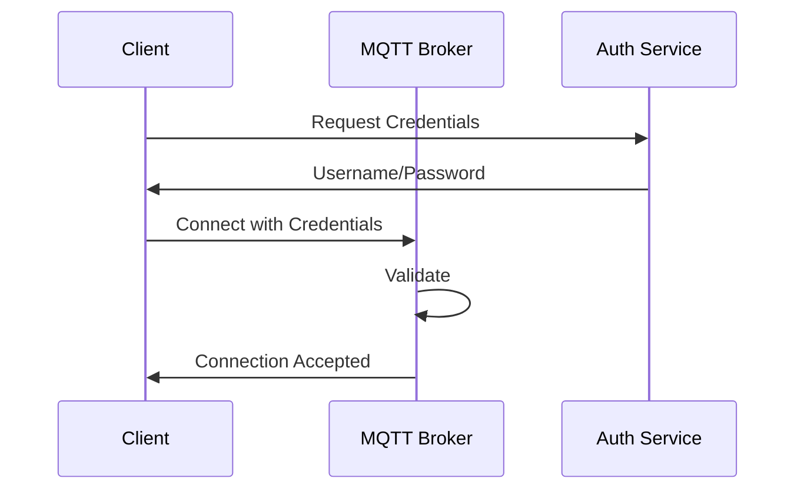

## Overview

The MQTT interface provides real-time access to position data, system events, and status updates from the Locus RTLS system. This low-latency protocol is ideal for applications requiring immediate position updates and system monitoring.

## Connection Details

### Broker Configuration
| Parameter | Value | Description |
|-----------|-------|-------------|
| Host | mqtt.rtls.example.com | MQTT broker hostname |
| Port | 1883 | Standard MQTT port |
| Port (TLS) | 8883 | Secure MQTT port |
| QoS Levels | 0, 1, 2 | Supported quality of service |
| Keep Alive | 60 seconds | Recommended keep-alive |

### Authentication


## Topic Structure

### Subscribe Topics
| Topic | Description | QoS | Message Type |
|-------|-------------|-----|--------------|
| rtls/position/updates/# | All position updates | 0 | Position |
| rtls/position/updates/+/tag/{tag_id} | Single tag updates | 0 | Position |
| rtls/anchor/status/# | All anchor status updates | 1 | Status |
| rtls/anchor/status/+/anchor/{anchor_id} | Single anchor status | 1 | Status |
| rtls/system/status | System status updates | 1 | Status |
| rtls/system/alerts | System alerts | 2 | Alert |
| rtls/zone/+/occupancy | Zone occupancy updates | 0 | Occupancy |

### Publish Topics
| Topic | Description | QoS | Message Type |
|-------|-------------|-----|--------------|
| rtls/tag/command/{tag_id} | Send commands to tags | 1 | Command |
| rtls/anchor/config/{anchor_id} | Configure anchors | 1 | Config |
| rtls/system/command | System-wide commands | 2 | Command |

### Wildcard Usage
- Single-level: `+` (matches one topic level)
  - Example: `rtls/position/updates/+/tag/123`
  - Matches: `rtls/position/updates/zone1/tag/123`
  - Doesn't match: `rtls/position/updates/zone1/area2/tag/123`

- Multi-level: `#` (matches multiple topic levels)
  - Example: `rtls/position/updates/#`
  - Matches: `rtls/position/updates/zone1/tag/123`
  - Matches: `rtls/position/updates/zone1/area2/tag/123`

## Message Formats

### Position Update Message
```json
{
    "type": "position_update",
    "timestamp": "2024-03-20T15:30:00Z",
    "tag_id": "tag123",
    "position": {
        "x": 10.5,
        "y": 20.3,
        "z": 1.5
    },
    "quality": 0.95,
    "anchor_count": 4,
    "zone": "warehouse_1"
}
```

### Tag Command Message
```json
{
    "type": "tag_command",
    "timestamp": "2024-03-20T15:30:00Z",
    "command": "update_rate",
    "parameters": {
        "rate": 10,
        "duration": 3600
    }
}
```

### Anchor Status Message
```json
{
    "type": "anchor_status",
    "timestamp": "2024-03-20T15:30:00Z",
    "anchor_id": "anchor123",
    "status": "active",
    "metrics": {
        "uptime": 1234567,
        "temperature": 25.5,
        "voltage": 12.1,
        "rx_count": 1000,
        "tx_count": 1000
    }
}
```

## Implementation Guidelines

### Topic Design
1. **Hierarchical Structure**
   - Use logical grouping
   - Include entity types
   - Consider scalability
   - Enable efficient filtering

2. **QoS Selection**
   - QoS 0: Position updates (high frequency)
   - QoS 1: Status updates (important)
   - QoS 2: Critical commands (must deliver)

### Connection Management
1. **Reliability**
   - Implement reconnection logic
   - Use clean sessions appropriately
   - Monitor connection health
   - Handle network issues

2. **Performance**
   - Batch small messages
   - Use appropriate QoS levels
   - Monitor message rates
   - Handle backpressure

### Security
1. **Authentication**
   - Use TLS for transport
   - Implement strong passwords
   - Rotate credentials
   - Monitor access

2. **Authorization**
   - Restrict topic access
   - Implement ACLs
   - Log all actions
   - Regular audits

## Related Documentation

- [API Client Examples](./apiclientexamples) - For detailed MQTT client implementation examples
- [API Payload Samples](./apipayloadsamples)
- [System Architecture](../rtlstechnology/rtlsystemarchitecture)

<Callout type="warning">
Ensure proper security measures are implemented when connecting to the MQTT broker, especially when dealing with sensitive location data.
</Callout>

<Callout type="info">
Contact Locus support for MQTT broker credentials and detailed integration guidelines specific to your deployment.
</Callout>
