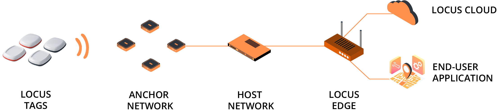

# Welcome to Locus RTLS Documentation

Discover the power and precision of the Locus Real-Time Location System (RTLS). This documentation provides a comprehensive guide to Locus RTLS, a system built and designed for large, scalable, and industrial deployments. The Locus RTLS Enterprise Edition can position thousands of tags over large areas with 10 to 30 cm accuracy. The Enterprise Edition hardware supports a wide range of settings that allow fine-tuning and custom optimizations. Data update rate, radio range, battery life, and additional sensor read-outs can all be adjusted to fit the customized application at hand.

## System Components

Before getting started, it is crucial to understand and review the main building blocks of Locus RTLS. The Enterprise positioning system

- **UWB Hardware (A network of Anchors and tags)** : The Locus Hardware comprising of Locus Tags (mobile trackers) and Locus Anchors (stationary base stations) are the backbone for the real-time location system.
- **Locus Location Engine (LLE)** : The LLE is a physical edge device housing the core RTLS positioning server and connects to the Anchors through Ethernet (Cat 5.e). It is responsible for gathering all data received form anchors and transforms it into a cartesian coordinate (position). By Connecting to this Edge server, you can receive the real-time position data. There maybe multiple instances of LLEs in a single RTLS project .
- **The Locus 3D Software** : The Locus 3D Software is an enterprise application software and interface to install, configure and visualize the real-time position updates from Location engine. It can be complete run locally from the Location engine itself or it can be remotely accessed using Locus Partner Portal online.

Explore the documentation to learn how to deploy, configure, and manage your Locus RTLS, or jump directly to our Quick Start guides if you're ready to begin.