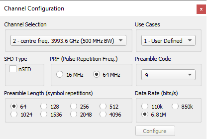
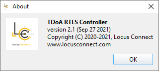
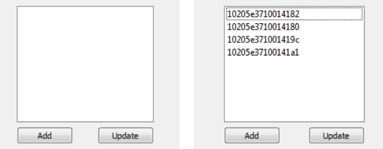
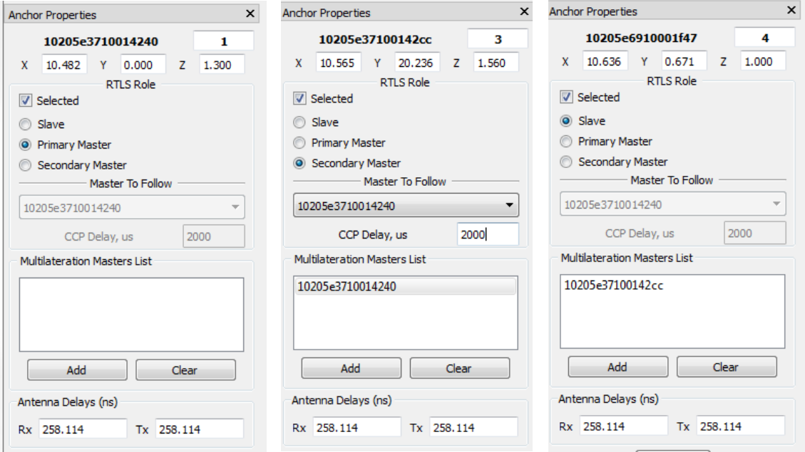
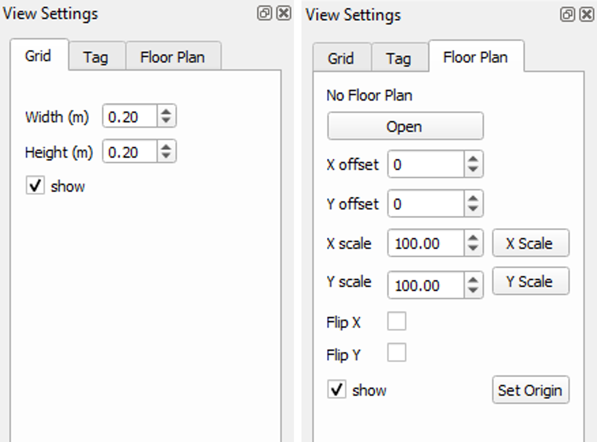

# Controller UI Definitions

## Drop down menus

### RTLS Menu
The RTLS drop down menu presents the following options : 

- **Anchor Positioning**
    - **Rotate 90** rotate the anchors clockwise 90 degrees
    - **Flip X-Axis** : flip the anchors on the display along x-axis
    - **Flip Y-Axis:** flip the anchors on the display along the y-axis
- **Channel Configuration** : this opens a Channel Configuration widget through which the user can vary the system’s anchor and tag UWB parameters.
  
<figure markdown>
  { loading=lazy }
  <figcaption>Channel Configuration window</figcaption>
</figure>

| Field name        | Description                                                                                                                                                                                                                                                                                                                                                                                          |
| ----------------- | :--------------------------------------------------------------------------------------------------------------------------------------------------------------------------------------------------------------------------------------------------------------------------------------------------------------------------------------------------------------------------------------------------- |
| Channel Selection | Configures the operating channel / frequency                                                                                                                                                                                                                                                                                                                                                         | 
| Preamble Code     | Allows the user to select the preamble code to be used                                                                                                                                                                                                                                                                                                                                               |  
| PRF               | Allows the user to select between 16 and 64 MHz PRFs                                                                                                                                                                                                                                                                                                                                                 | 
| Preamble Length   | Allows the user to select the preamble length                                                                                                                                                                                                                                                                                                                                                        |
| Data Rate         | Allows the user to choose one of the data rates (110 kbps, 850kbps or 6.81 Mbps)                                                                                                                                                                                                                                                                                                                     |
| Use Cases         | There are 3 use case options: <ul><li>User Defined – the user can select any of the channel parameters</li><li>Long Range – system will be configured for longest range</li><li>Max Density – system will be configured for maximum density</li>Default – system will be restored to default settings</ul>                                                                                           |
  
- **Resync** :  this is used to send “tag training” command to the LLE. (Usually you are not supposed to be using this anytime during installation)

- **LLE Configuration**: this opens the LLE connection configuration parameters and enables their configuration

- **Load Configuration** : this lets the user load system configuration files. There are 3 files: CCchan_config.xml (this should be loaded first – the file select window will show “Load RF Config”; CCanch_config.xml (this is loaded next – the file window will show “Load Anchor Config”; CCview_config.xml and CCtag_config.xml are loaded automatically 

- **Save Configuration** : this lets the user save system configuration files.Firstly the user is prompted to save the channel configuration (e.g. CCchan_config.xml); then anchor configuration (e.g. CCanch_config.xml) and finally the CCview_config.xml and CCtag_config.xml are saved automatically.

- **Save As New Configuration** – this lets the user save system configuration files with different names. Firstly the user is prompted to save the channel configuration (e.g. CCchan_config.xml); then anchor configuration (e.g. CCanch_config.xml) and finally the CCview_config.xml
 
### Advanced Menu
The “Advanced” drop down menu presents the following options:

- **Log Accumulator** – this feature can be used to log a number of Blink frame picked up from the tags. The user needs to select the anchors, which will log the CIRs. (The maximum number that can be logged at a time is 65k).
- **Pan To** – this locates the anchor on the Main Display Area window, it places the selected anchor in the centre of the Main Display Area window.
- **Two-Way Ranging (TWR)** – this performs TWR distance between the selected anchors. If performed between master and the slave then this value will be used in RTLS algorithms in location engine. sync algorithm for synchronising the slave’s time. It is recommended that TWR is performed between each master-slave pair, as using the RF distance as opposed to geometric distance, gives better clock sync performance (especially in NLOS scenarios, e.g. if master and slave are not in same room).
- **Power Test**: this feature can be used to configure the selected anchor for continuous transmit mode, which can be used to test the power level and spectral properties of the anchor HW. This mode stops after 20 seconds. Note this test mode will disrupt normal operation. The intention is that this will be only used when testing/calibrating anchor power.
### View Menu
View menu contains the checkbox to enable/disable UI components of RTLS controller

### Help Menu
- **About** : this opens the “About” window which provides information on the revision of the client.

<figure markdown>
  { loading=lazy }
  <figcaption> About window</figcaption>
</figure>

## Widgets

### Anchor list widget
The anchor list widget will list all of the anchors nodes that have been connected to the location engine server. If the Controller has already connected to LLE the list will contain all of the currently discovered anchors. To update / populate the list, the user can either add new anchors individually by pressing the “Add” button or, once the connection to the LLE is active, press the “Update” button to get/update the list of anchors that have been discovered by the LLE.

<figure markdown>
  { loading=lazy }
  <figcaption> Anchors list widget, showing an empty list and the updated list</figcaption>
</figure>

### Anchor properties widget 
This widget is used to configure anchor parameters for the RTLS system to perform location calculation. It  shows the following as per Figure below

<figure markdown>
  { loading=lazy }
  <figcaption> Anchor Properties widget: Primary, Secondary Masters and Slave roles.</figcaption>
</figure>

The individual configuration properties definitions are listed below

|Field Name      |Type     |  Description                                                                                                                                                                                                                                                                                                                                                   |
|:---------------|:------- | :------------------------------------------------------------------------------------------------------------------------------------------------------------------------------------------------------------------------------------------------------------------------------------------------------------------------------------------------------------- |
|ID              |uint64   |  Anchor’s unique identifier. Each anchor that is part of the RTLS needs to have a unique identifier. (64 bits)                                                                                                                                                                                                                                                 |
|# (Number)      |int      |  RTLS number. Each of the anchor nodes should be given an RTLS number.                                                                                                                                                                                                                                                                                         |
|X, Y, Z         |double   |  Anchor x, y, z co-ordinate values                                                                                                                                                                                                                                                                                                                             |
|Master          |int      |  0 = Slave, 1 = Primary Master, 2 = Secondary Master                                                                                                                                                                                                                                                                                                           |
|Selected        |boolean  |  The selected checkbox enable/diable the anchor that will participate in RTLS operation. This must be set true for all active anchors that are part of the RTLS network.                                                                                                                                                                                       |
|Antenna Delay Rx|double   |  Receive part of the anchor’s antenna delay, value in ns. (Leave this as is, if you cannot understand)                                                                                                                                                                                                                                                         |
|Antenna Delay Tx|double   |  Transmit part of the anchor’s antenna delay, value in ns.                                                                                                                                                                                                                                                                                                     |
|Primary Master  |uint64   |  This is an ID of a primary master that a secondary master will follow. If this is the same as the anchors’ own ID (or 0x0) this means that the anchor is primary master                                                                                                                                                                                       |
|Lag (Delay)     |double   |  Applicable to the secondary master Role only. This is the time lag following the reception of its primary master’s Clock packet after which the secondary master will send it's clock packet. Please refer to FAQ understanding of multimaster configuration for future details of system RTLS configuration                                                  |
|Master List     |uint64[] |  Array of Master IDs that this anchor will be synchronized with in the LLE. NOTE: The anchor must have at least one master anchor in the list. If the list is empty then the LLE will not be able to synchronize the timestamps from the anchor                                                                                                                |

### View Settings widget
This allows the user to upload a floor plan and specify the grid, X and Y axis scale and origin positions

<figure markdown>
  { loading=lazy }
  <figcaption> View Settings widget</figcaption>
</figure>

- **Grid Tab**

|     Field Name |   Description                                       |
| :------------- | :-------------------------------------------------- |
|     Width      |   Sets the horizontal grid spacing, unit is meters  |
|     Height     |   Sets the vertical grid spacing, unit is meters    |
|     show       |   Shows or hides the grid                           |

- **Floor Plan Tab**

|     Field Name                   | Description                                                                                                                                                                                                                                |
| :------------------------------- | :----------------------------------------------------------------------------------------------------------------------------------------------------------------------------------------------------------------------------------------- |
|     Open                         | This lets the user upload an image of the floor plan of the area where the anchors are installed                                                                                                                                           |
|     X offset                     | This is the origin offset in the X direction from the 0, 0 point on the floorplan (in pixels)                                                                                                                                              |
|     Y offset                     | This is the origin offset in the Y direction from the 0, 0 point on the floorplan (in pixels)                                                                                                                                              |
|     X scale                      | This is the scale (pixels per meter) of the x axis (in pixels per meter)                                                                                                                                                                   |
|     Y scale                      | This is the scale (pixels per meter) of the y axis (in pixels per meter)                                                                                                                                                                   |
|     Flip X                       | This flips the image in the x-axis                                                                                                                                                                                                         |
|     Flip Y                       | This flips the image in the y-axis                                                                                                                                                                                                         |
|     show                         | This shows or hides the origin in the map                                                                                                                                                                                                  |
|     Set Origin                   | This button lets the user click and set the origin coordinates                                                                                                                                                                             |
|     X Scale button               | Pressing this button produces a measuring tool with which the user can firstly select a distance on the map and then enter the actual distance (in meters) that range corresponds to, this sets the X scale value                          |
|     Y Scale button               | Pressing this button produces a measuring tool with which the user can firstly select a distance on the map and then enter the actual distance (in meters) that range corresponds to, this sets the Y scale value                          |

### Minimap widget
This widget shows the loaded image and the zoomed in area (which is shown in the Main Display Area window)

## 