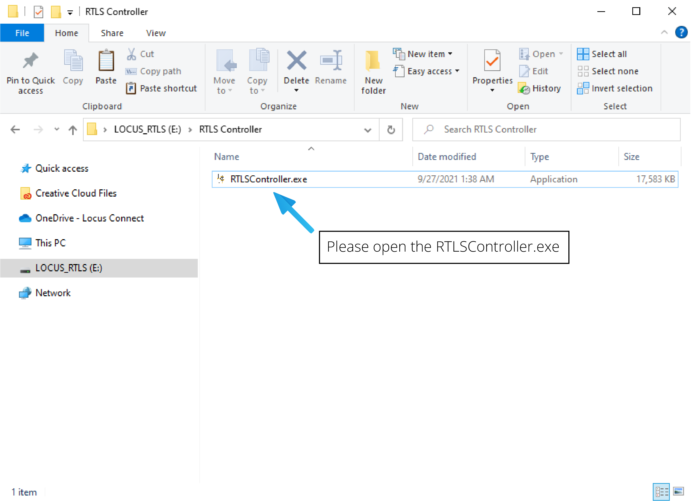
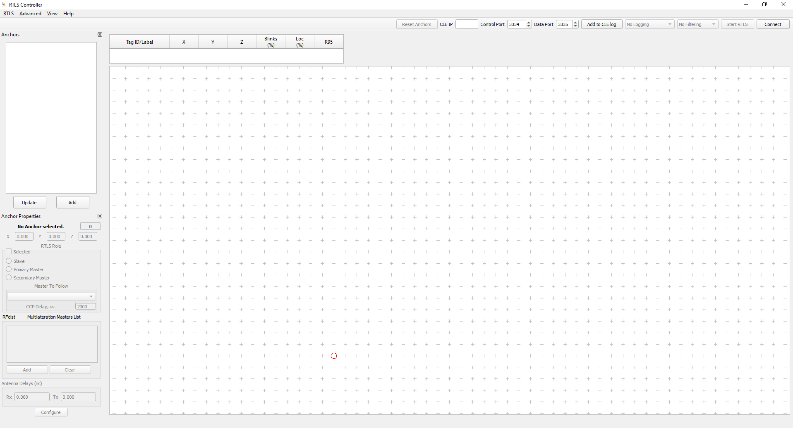
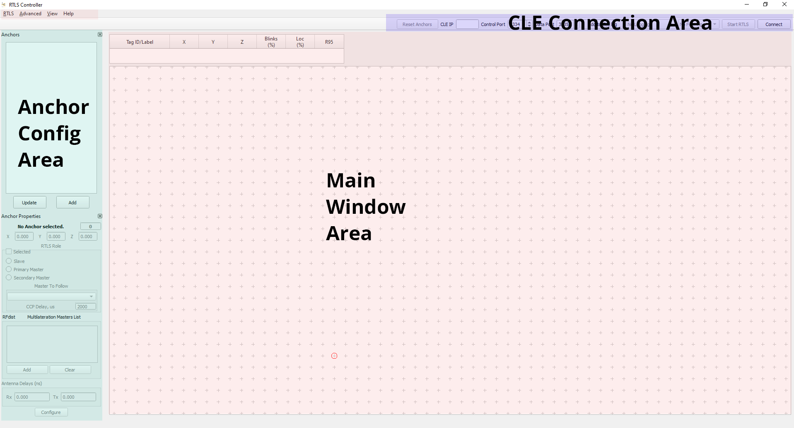

# RTLS Controller Tool Overview

## Installation Steps

The controller is a Windows 32-bit standalone application, that is supplied to you via email or USB flash drive by the Locus CX team.

1. Open the installer file `RTLSController.exe` on the USB Flash drive 

<figure markdown>
  { loading=lazy }
  <figcaption>Locus RTLS Overview</figcaption>
</figure>

2. You can proceed with installation by keeping the setup configuration to defaults.
3. After the installation, you should be able to see the below initial UI on the desktop.

<figure markdown>
  { loading=lazy }
  <figcaption>Locus RTLS Overview</figcaption>
</figure>

## Important components of RTLS controller application
1. Main window - this is the main user interface and it contains:
    - Drop down menus - RTLS, Advanced, View Help
    - A table of discovered tags and the main display area, which shows the position of tags and anchors on a floor plan
1. CLE Connection area - This is used to establish and monitor connection to the central location engine. This is also used to START/STOP the RTLS system. 
2. Anchor Configuration area - This area is used to configure anchor configuration during RTLS deployment/installation. 
<figure markdown>  { loading=lazy }  <figcaption>Different sections of  RTLS Controller</figcaption></figure>

