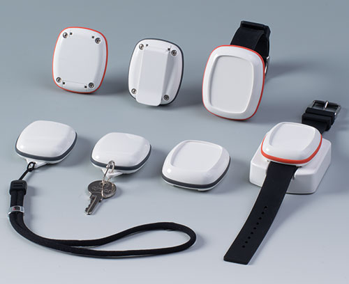

!!! warning ""
    :fontawesome-solid-exclamation-circle: When installing your tag, make sure that the UWB antenna side of the tag is facing upwards for optimal radio transmission.
    
## Locus Asset Tag

Locus asset tag are industrial built to with stand harsh heavy metal environment. They can be installed on any asset like pallets, over forklifts or to any other equipment. To make it easy to install tag comes with multiple install options.

- **Option 1 :** The Tags can be mounted with 2 x M4 screws using the eyelets on either side 
<!-- NEED to insert image -->
- **Option 2 :** The asset tags can be attached to any object using industrial wraps by looping through the eyelets
<!-- Need to insert image -->
## Locus Wearable Tag

Locus wearable are built with skin safe plastic material and supposed to be used for personnel tracking. It comes with multiple accessories depending on application scenarios.
- lanyard
- belt clip-on
- wrist watch
- keychain

<figure markdown>
  {align=center}
  <figcaption>Wearable tag supports - Lanyard, belt clip, wrist watch, keychain </figcaption>
</figure>