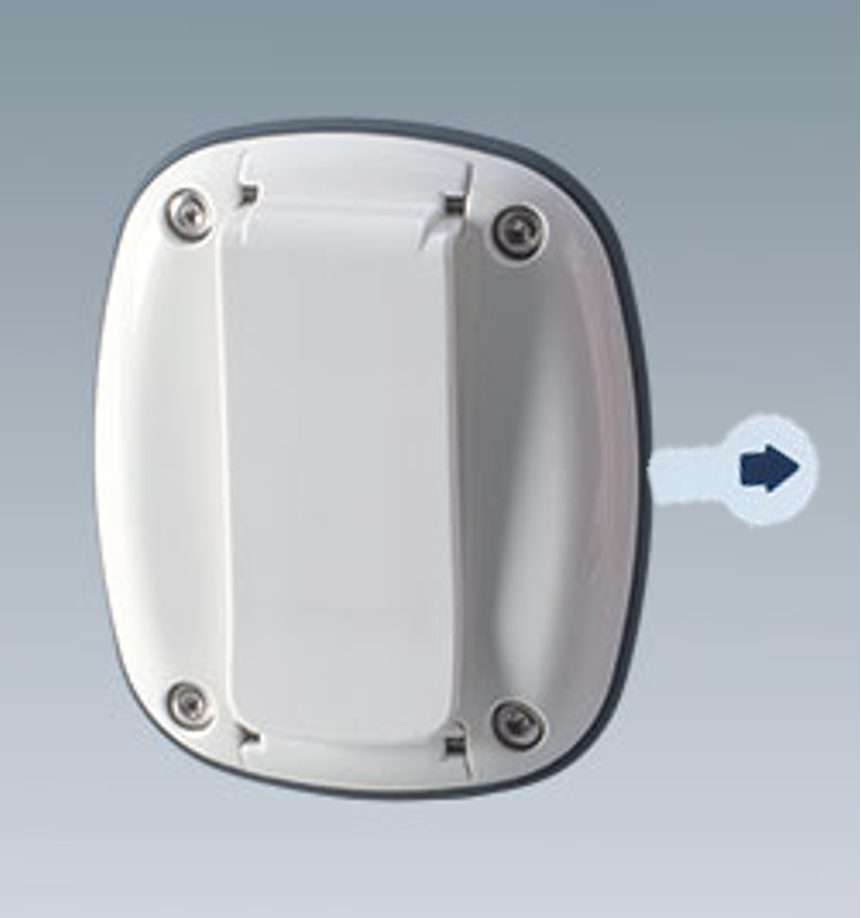

# Turning on tags
The Wearable Tag comes preinstalled with a standard 3V / 225 mAh CR2032 coin cell battery.

After unboxing  your tags, please remove insulation plastic by pulling it out in the arrow direction. The tag will be immediately turned on as soon as insulation plastic is removed.

<figure markdown>
  {width="250" align=center}
  <figcaption>Pull out the insulation plastic to turn on the tag</figcaption>
</figure> 

!!! info ""
    Sometime due to environmental factors like temperature and humidity affect the battery inside tag to be depleted. In this case please see how to replace the tag battery - [Tag maintenance](..%5C..%5CTroubleshooting%20&%20FAQ%5CTag%20maintenace.md)
