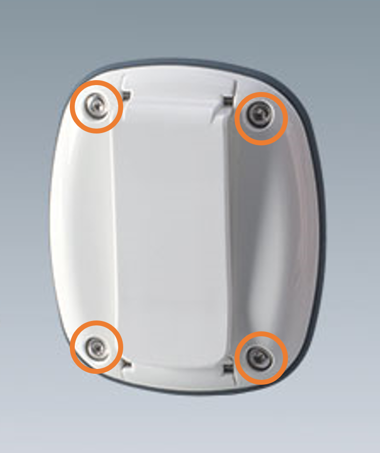

# Tag maintenance guide

## Replacing tag battery

### Industrial Tag
The industrial tag is shipped with a standard 3V / 230 mAh CR2032 coin cell battery that can easily be replaced.

1. Flip to the back side of the industrial tag, and hold the upper lid and lower lid with both hands. The industrial tag has been designed on a spin-n-lock mechanism. The upper lid is fastened by rotating over the lower lid. 
2. Spin the upper lid counter-clockwise keeping the lower lid fixed. Carefully remove the upper lid and keep the O-ring guard is a safe place. At this moment you should be able to see the electronic PCB
3. Push to eject out the coin cell
4. Place the new CR2032 coin cell battery inside
5. Carefully place the O-ring at the periphery of lower lid and spin back the upper lid back in place
6. The tag will be automatically turned on as soon as new battery inserted.

### Wearable Tag

The wearable tag is shipped with a standard 3V / 230 mAh CR2032 coin cell battery that can easily be replaced.

1. Flip to the back side of the industrial tag, with the back facing towards you.
2. Use a T6 screwdriver and remove the 4 screw to lift the back cover. 

<figure markdown>
  {width="200" align=center}
  <figcaption>Lookout for 4 screws</figcaption>
</figure>

3. Carefully remove the PCB and turn it over to reveal battery compartment.
4. Push out the coin cell battery.
5. Place the new CR2032 coin cell battery inside.
6. Carefully put the PCB back again and put the back cover in place.
7. Tighten the 4 screws again to fix the back cover.
8. The tag will be automatically turned on as soon as new battery inserted.