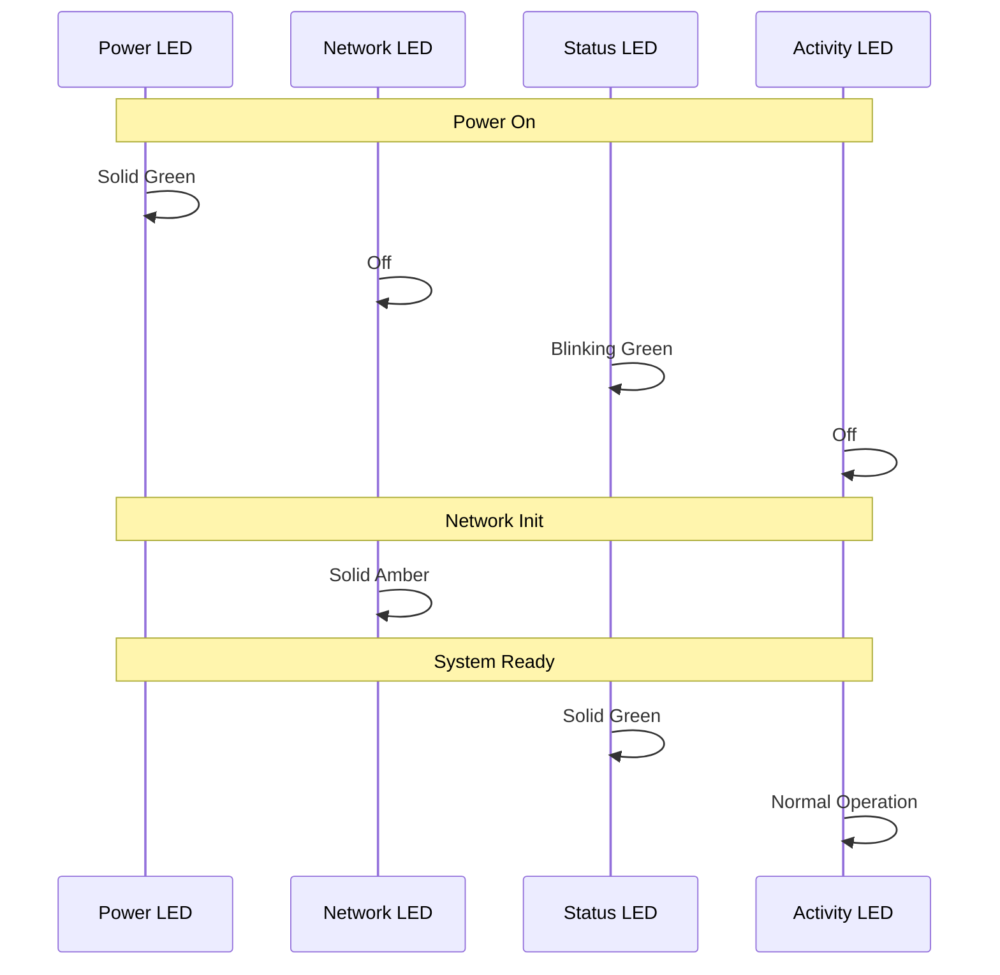

## LED Overview

Locus RTLS Anchors feature multiple status LEDs that provide visual feedback on the anchor's operational state. Understanding these indicators is crucial for installation, troubleshooting, and maintenance.

## LED Locations and Functions

### Physical Layout
- **Power LED** (Green) - Top right, indicates power status
- **Network LED** (Amber) - Adjacent to Ethernet port, shows network connectivity
- **Status LED** (Multi-color) - Front center, displays operational state
- **Activity LED** (Blue) - Front lower section, indicates UWB activity

### Visual Reference

## LED Status Patterns

### Power LED (Green)
| State | Meaning | Action Required |
|-------|---------|----------------|
| Solid Green | Normal power operation | None |
| Off | No power supply | Check power connection |
| Blinking Green | Power-on self-test | Wait for completion |
| Rapid Blinking | Power issue detected | Check power source |

### Network LED (Amber)
| State | Meaning | Action Required |
|-------|---------|----------------|
| Solid Amber | Network connected | None |
| Blinking Amber | Network activity | None |
| Off | No network connection | Check network cable |
| Rapid Blink | Network error | Verify network settings |

### Status LED (Multi-color)
| State | Meaning | Action Required |
|-------|---------|----------------|
| Solid Green | Normal operation | None |
| Solid Red | Error condition | Check RTLS Hub |
| Blinking Green | Configuration mode | None if intentional |
| Blinking Red | Hardware fault | Contact support |
| Red/Green Alternating | Firmware update | Do not power off |
| Off | Not operational | Check power and config |

### Activity LED (Blue)
| State | Meaning | Action Required |
|-------|---------|----------------|
| Blinking Blue | Tag detection | None |
| Off | No UWB activity | Check if expected |
| Rapid Blue | High tag traffic | Monitor system load |
| Solid Blue | UWB error | Check configuration |

## Boot Sequence

### Normal Boot Process
1. **Power-Up** (0-5 seconds)
   - All LEDs: Brief illumination
   - Power LED: Solid green
   
2. **Initialization** (5-15 seconds)
   - Status LED: Blinking green
   - Network LED: Off
   
3. **Network Connection** (15-20 seconds)
   - Network LED: Solid amber
   - Status LED: Continues blinking
   
4. **System Ready** (20-30 seconds)
   - Status LED: Solid green
   - Activity LED: Begins normal operation

### Boot Sequence Diagram

## Troubleshooting Guide

### Common Issues
| LED Pattern | Issue | Solution |
|------------|--------|----------|
| All LEDs Off | No power | Check PoE/power supply |
| Status Red | System error | Restart anchor |
| Network Off | Connection lost | Verify network |
| All Blinking | Recovery mode | Use RTLS Hub recovery |

### Advanced Diagnostics
- **Multiple LED Patterns**
  - Record the sequence of LED states
  - Note any pattern changes
  - Check environmental factors
  - Document timing of changes

## LED Configuration

### RTLS Hub Settings
- Activity LED brightness control
- Status LED enable/disable
- Custom pattern configuration
- Diagnostic mode settings

### Best Practices
- Keep Activity LED enabled for monitoring
- Use appropriate brightness for environment
- Document custom LED configurations
- Regular LED function verification

## Related Documentation

- [Anchor Overview](./anchoroverview)
- [Technical Specifications](./technicalspecifications)
- [Troubleshooting Guide](./troubleshooting)
- [Power Supply Guide](./powersupply)
