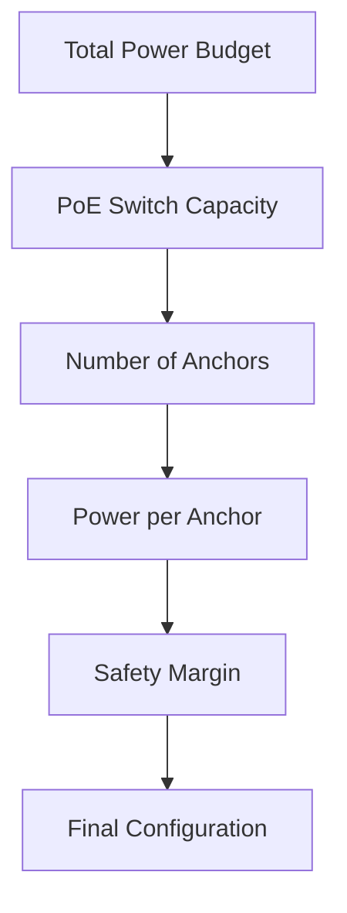

## Overview

Proper power delivery is essential for reliable anchor operation. This guide covers all power supply options and requirements for Locus RTLS Anchors.

## Power Methods

### Power over Ethernet (PoE)

#### Specifications
| Parameter | Value | Notes |
|-----------|--------|-------|
| Standard | IEEE 802.3af/at | PoE/PoE+ |
| Voltage | 37-57V DC | Nominal 48V |
| Power Class | Class 2/3 | Model dependent |
| Typical Power | 4-7W | Operating range |
| Maximum Power | 13W | Peak consumption |

#### Features
- Single cable for power and data
- Simplified installation
- Centralized power management
- Support for remote reset

### Direct DC Power

#### USB Power
| Parameter | Value | Notes |
|-----------|--------|-------|
| Connector | Micro-USB | Type B |
| Voltage | 5V DC | ±5% |
| Current | 1A typical | 2A max |
| Power | 5W typical | USB 2.0/3.0 |

#### DC Jack (Optional)
| Parameter | Value | Notes |
|-----------|--------|-------|
| Connector | 2.1mm barrel | Center positive |
| Voltage | 12-24V DC | Model specific |
| Current | 0.5A typical | 1A max |
| Power | 6-12W | Model dependent |

## Power Requirements

### Environmental Factors
- Operating temperature impact
- Cable length considerations
- Installation height effects
- Environmental protection

### Power Budget Planning

## Installation Guidelines

### PoE Installation
1. **Switch Selection**
   - Enterprise-grade PoE switch
   - Adequate power budget
   - Port capacity planning
   - Management features

2. **Cabling Requirements**
   - Cat5e or better
   - Maximum length 100m
   - Proper termination
   - Cable routing

3. **Power Planning**
   - Power budget calculation
   - Redundancy options
   - UPS backup
   - Future expansion

### DC Power Installation
1. **Power Source Selection**
   - Quality power supplies
   - Proper voltage rating
   - Current capacity
   - Safety certifications

2. **Installation Best Practices**
   - Cable management
   - Strain relief
   - Access for maintenance
   - Environmental protection

## Troubleshooting

### Common Issues
| Issue | Possible Causes | Solution |
|-------|----------------|----------|
| No Power | Cable/PSU fault | Check connections |
| Intermittent | Loose connection | Secure cables |
| Low Power | Wrong PSU/cable | Verify specifications |
| PoE Issues | Switch config | Check port settings |

### Diagnostic Steps
1. **Visual Inspection**
   - Check LED indicators
   - Verify connections
   - Inspect for damage
   - Check ventilation

2. **Power Testing**
   - Measure voltage
   - Check current draw
   - Test alternative port
   - Verify PSU output

## Safety Guidelines

### Installation Safety
- Follow local electrical codes
- Use certified components
- Proper grounding
- Surge protection

### Maintenance Safety
- Power down procedure
- Safe access planning
- Tool requirements
- Documentation

## Related Documentation

- [Anchor Overview](./anchoroverview)
- [LED Indicators](./anchorledindication)
- [Installation Guide](./assemblyandmounting)
- [Technical Specifications](./technicalspecifications)

<Callout type="warning">
Always use the power supply method and specifications recommended for your specific Locus Anchor model. Using incorrect power sources can damage the device. Never connect multiple power sources simultaneously unless specifically instructed in your model's documentation.
</Callout>
