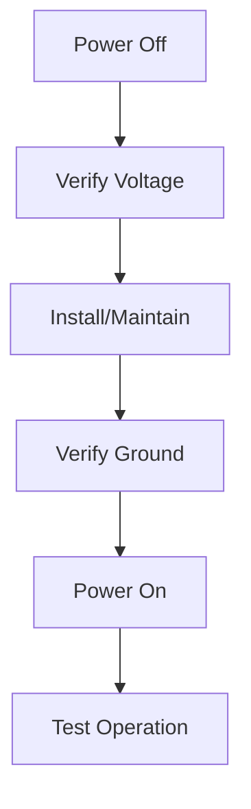

## Safety Guidelines

### Installation Safety


| Activity | Required PPE | Additional Equipment |
|----------|-------------|---------------------|
| Height Work | Hard hat, harness | Ladder, platform |
| Power Work | Insulated gloves | Voltage tester |
| Drilling | Safety glasses, mask | Dust extraction |
| General | Steel-toe boots | Tool belt |

### Electrical Safety


#### Power Requirements
- IEEE 802.3af/at PoE only
- Proper grounding required
- Surge protection recommended
- Circuit breaker protection

### RF Safety Guidelines
| Parameter | Limit | Notes |
|-----------|-------|--------|
| UWB Power | < 0.1W | Below safety limits |
| Separation | 20cm min | During operation |
| Exposure | Unrestricted | Normal use |
| Interference | Minimal | Medical devices |

## Regulatory Compliance

### FCC Compliance (USA)
```text
This device complies with Part 15 of the FCC Rules.
FCC ID: XXXXXRTLSAX

Operation conditions:
1. May not cause harmful interference
2. Must accept received interference
```

#### Technical Requirements
- RF exposure compliance
- EMC requirements
- Spectrum usage rules
- Labeling requirements

### CE Compliance (EU)


#### Directives
- RED 2014/53/EU
- LVD 2014/35/EU
- EMC 2014/30/EU
- RoHS 2011/65/EU

#### Standards
| Standard | Description | Status |
|----------|-------------|--------|
| EN 300 220 | RF Requirements | Compliant |
| EN 301 489 | EMC Requirements | Compliant |
| EN 62368 | Safety Requirements | Compliant |
| EN 50665 | RF Exposure | Compliant |

### Industry Canada (IC)
```text
IC: XXXXX-RTLSAX

Compliance conditions:
1. No interference operation
2. Accept all interference
```

## Environmental Specifications

### Operating Conditions
| Parameter | Range | Notes |
|-----------|-------|--------|
| Temperature | -20°C to +65°C | Operating |
| Storage | -30°C to +70°C | Non-operating |
| Humidity | 5-95% | Non-condensing |
| IP Rating | IP65 | Dust/water resistant |

### Environmental Compliance

#### RoHS Compliance
- Lead-free construction
- Compliant components
- Proper documentation
- Regular testing

#### WEEE Compliance


- Proper disposal required
- Recycling programs
- Collection points
- Documentation

## Product Lifecycle

### Installation
- Site survey required
- Safety assessment
- Proper mounting
- Power verification

### Operation
- Regular inspection
- Performance monitoring
- Safety compliance
- Update management

### Maintenance
- Scheduled checks
- Safety procedures
- Documentation
- Proper tools

### Disposal
1. **Power Down**
   - Proper shutdown
   - Power isolation
   - Network disconnect
   
2. **Removal**
   - Safe dismounting
   - Cable management
   - Hardware collection
   
3. **Processing**
   - Sort components
   - Identify recyclables
   - Proper disposal
   - Documentation

## Warranty Information

### Coverage
- 2-year standard warranty
- Extended options available
- Parts and labor included
- Technical support

### Terms
- Proper installation required
- Regular maintenance needed
- Documentation mandatory
- Registration recommended

## Contact Information

### Support Channels
- Technical Support: support@locusconnect.com
- Safety Inquiries: safety@locusconnect.com
- Regulatory: compliance@locusconnect.com
- General: info@locusconnect.com

<Callout type="warning">
Always follow local safety regulations and building codes during installation and maintenance. Maintain proper documentation of all safety procedures and regulatory compliance measures.
</Callout>
