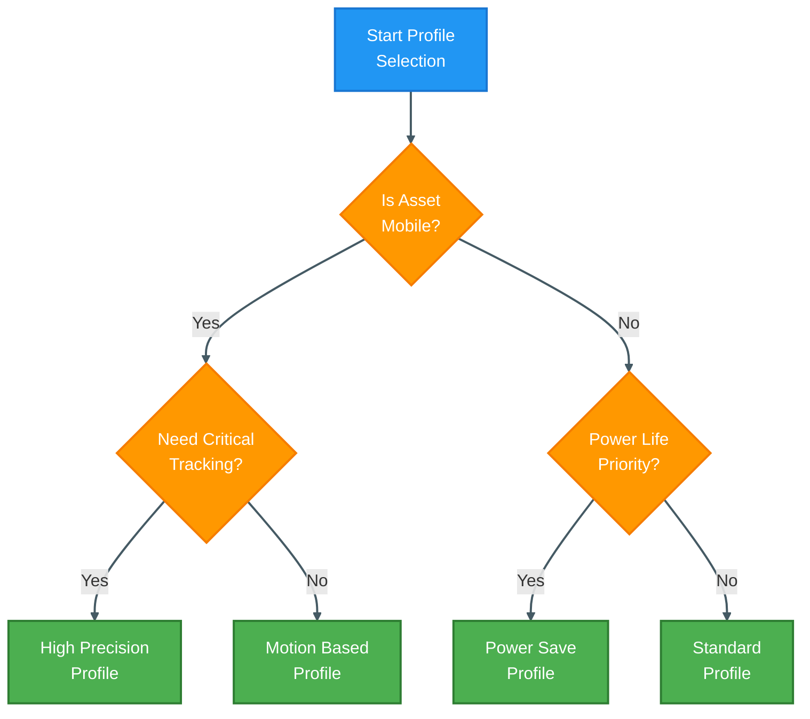

## Overview

Locus RTLS tags come with pre-configured profiles optimized for common use cases. This guide helps you select and customize the most appropriate configuration for your application.

## Standard Profiles

### Profile Summary
| Profile | Update Rate | Accuracy | Battery Life | Best For |
|---------|-------------|----------|--------------|----------|
| High Precision | 10Hz | ±10cm | 3-6 months | Critical tracking |
| Standard | 1Hz | ±20cm | 1-2 years | General use |
| Power Save | 0.2Hz | ±30cm | 3-5 years | Static assets |
| Motion Based | Variable | Variable | 1-3 years | Mobile assets |
| Zone Based | Event-based | Zone level | 2-4 years | Area monitoring |

### Profile Selection

## Profile Details

### High Precision Profile
| Parameter | Value | Description |
|-----------|-------|-------------|
| Update Rate | 10Hz | Ten updates per second |
| Radio Power | Maximum | Full range coverage |
| Sleep Modes | Disabled | Continuous tracking |
| Motion Detection | Optional | Application specific |
| LED Indication | Enabled | Visual feedback |

### Standard Profile
| Parameter | Value | Description |
|-----------|-------|-------------|
| Update Rate | 1Hz | Once per second |
| Radio Power | Medium | Balanced range |
| Sleep Modes | Light | Power optimization |
| Motion Detection | Enabled | Activity tracking |
| LED Indication | Events | Status indication |

### Power Save Profile
| Parameter | Value | Description |
|-----------|-------|-------------|
| Update Rate | 0.2Hz | Every 5 seconds |
| Radio Power | Minimum | Energy efficient |
| Sleep Modes | Deep | Maximum savings |
| Motion Detection | Enabled | Wake trigger |
| LED Indication | Disabled | Power saving |

### Motion Based Profile
| Parameter | Value | Description |
|-----------|-------|-------------|
| Update Rate | Variable | Motion dependent |
| Radio Power | Adaptive | Context based |
| Sleep Modes | Smart | Motion triggered |
| Motion Detection | Enhanced | Primary control |
| LED Indication | Activity | Motion feedback |

### Zone Based Profile
| Parameter | Value | Description |
|-----------|-------|-------------|
| Update Rate | Event | Zone transitions |
| Radio Power | Low | Area coverage |
| Sleep Modes | Adaptive | Zone dependent |
| Motion Detection | Basic | Support function |
| LED Indication | Zones | Location status |

## Configuration Parameters

### Radio Settings
- Channel selection
- Power levels
- Data rates
- Ranging modes
- Protocol options

### Power Management
- Sleep thresholds
- Wake intervals
- Motion sensitivity
- Battery monitoring
- Power modes

### Feature Control
- LED behavior
- Button functions
- Sensor options
- Alert conditions
- Data logging

## Customization Options

### Basic Adjustments
1. Update frequency
2. Sleep behavior
3. LED settings
4. Motion sensitivity
5. Alert thresholds

### Advanced Settings
| Setting | Range | Impact |
|---------|--------|---------|
| TX Power | -12 to +10 dBm | Range vs battery |
| Sleep Delay | 1-3600s | Response vs power |
| Motion Threshold | 0.01-2.0g | Sensitivity |
| Wake Duration | 0.1-10s | Power usage |

## Configuration Tools

### RTLS Hub Interface
- Profile selection
- Parameter adjustment
- Batch configuration
- Template management
- Configuration backup

### API Integration
- Remote configuration
- Automated setup
- Mass deployment
- Profile management
- Status monitoring

## Deployment Guidelines

### Initial Setup
1. **Profile Selection**
   - Use case analysis
   - Environment review
   - Performance needs
   - Power requirements

2. **Configuration**
   - Basic parameters
   - Feature activation
   - Testing setup
   - Performance validation

3. **Optimization**
   - Field testing
   - Parameter tuning
   - Battery validation
   - Coverage verification

### Best Practices
- Start with standard profiles
- Test before deployment
- Document changes
- Monitor performance
- Regular review

## Troubleshooting

### Common Issues
| Issue | Check | Solution |
|-------|-------|----------|
| Poor accuracy | Update rate | Increase frequency |
| Short battery | Power settings | Optimize profile |
| Missing updates | Sleep settings | Adjust triggers |
| Range issues | TX power | Adjust power |

### Validation Steps
1. Verify settings
2. Test performance
3. Check coverage
4. Monitor battery
5. Review logs

## Related Documentation

- [Smart Sleep Modes](./smartsleepmodes)
- [Tag Battery Guide](./tagbattery)
- [Tag Peripherals](./tagperipherals)
- [LC01 Series](./tagtypes/lc01series)
- [LC03 Series](./tagtypes/lc03series)

<Callout type="warning">
Configuration changes can significantly impact system performance and battery life. Always test new configurations in a controlled environment before full deployment.
</Callout>

<Callout type="info">
Contact Locus support for assistance with custom configurations or specific application requirements not covered by standard profiles.
</Callout>
