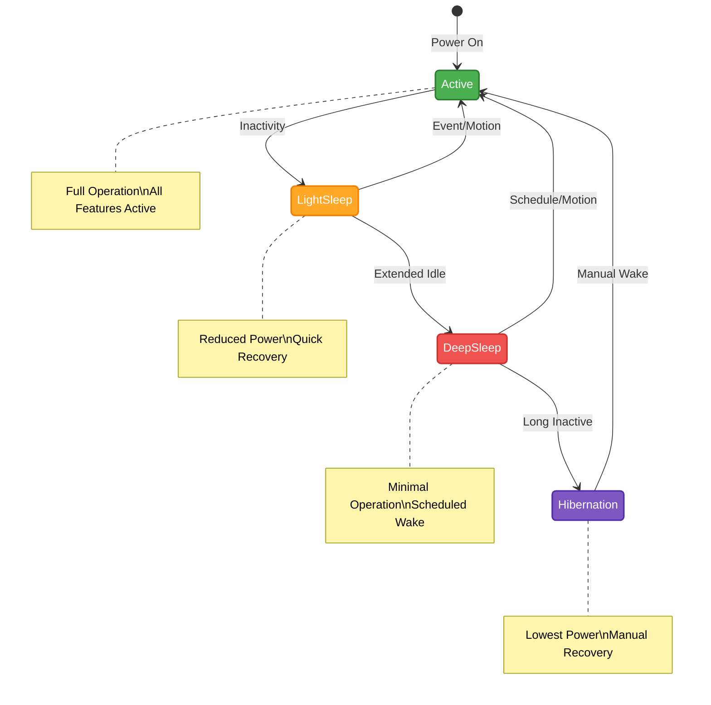

# Smart Sleep Modes

## Overview

Smart Sleep Modes are sophisticated power management features that significantly extend tag battery life while maintaining essential functionality. This guide explains available sleep modes and their optimal usage.

## Sleep Mode Types

### Basic Sleep Modes
| Mode | Power State | Wake Trigger | Battery Impact |
|------|-------------|--------------|----------------|
| Light Sleep | Partial shutdown | Any event | 50% reduction |
| Deep Sleep | Full shutdown | Scheduled/Motion | 90% reduction |
| Hibernation | Complete shutdown | Manual/Scheduled | 99% reduction |
| Adaptive | Dynamic | Context-based | 70-90% reduction |

### Mode Transitions

## Mode Descriptions

### Light Sleep
- Rapid wake-up
- Sensor monitoring
- Position updates paused
- LED disabled
- Radio in standby

### Deep Sleep
- Extended power saving
- Motion detection only
- Scheduled wake-ups
- All peripherals off
- Minimal power usage

### Hibernation
- Maximum power saving
- Complete shutdown
- Manual wake required
- Zero power peripherals
- Long-term storage

### Adaptive Sleep
- Context-aware
- Motion-based
- Schedule-aware
- Zone-based
- Activity-based

## Configuration Parameters

### Timing Settings
| Parameter | Range | Default | Impact |
|-----------|--------|---------|---------|
| Sleep Delay | 1-3600s | 60s | Initial sleep |
| Wake Duration | 0.1-10s | 1s | Active time |
| Deep Sleep Delay | 300-86400s | 3600s | Power saving |
| Schedule Interval | 1-168h | 24h | Regular wake |

### Trigger Settings
- Motion threshold
- Schedule times
- Zone boundaries
- Battery level
- System events

## Implementation Strategies

### Use Case Optimization
| Application | Recommended Mode | Wake Trigger |
|-------------|-----------------|--------------|
| Asset Tracking | Adaptive | Motion + Schedule |
| Personnel Safety | Light Sleep | Any Event |
| Vehicle Monitoring | Context-based | Motion + Zone |
| Environmental | Deep Sleep | Schedule |

### Environmental Considerations
- Temperature impact
- Motion frequency
- Update requirements
- Network coverage
- Application needs

## Advanced Features

### Smart Wake
- Motion prediction
- Pattern learning
- Zone awareness
- Priority events
- Conditional logic

### Power Profiles
| Profile | Sleep Strategy | Battery Life |
|---------|---------------|--------------|
| Always On | No sleep | 3-6 months |
| Standard | Light sleep | 1-2 years |
| Extended | Deep sleep | 2-4 years |
| Maximum | Hibernation | 4-5 years |

## Configuration Guide

### Setup Process
1. **Analysis**
   - Usage patterns
   - Environment
   - Requirements
   - Constraints

2. **Configuration**
   - Mode selection
   - Parameter setup
   - Trigger definition
   - Testing

3. **Optimization**
   - Performance monitoring
   - Battery tracking
   - Adjustment
   - Validation

### Best Practices
- Start conservative
- Monitor impact
- Adjust gradually
- Document changes
- Validate results

## Troubleshooting

### Common Issues
| Issue | Possible Cause | Solution |
|-------|---------------|----------|
| Won't sleep | Wrong triggers | Check settings |
| Won't wake | Deep sleep mode | Verify triggers |
| Erratic behavior | Conflicting rules | Review config |
| Battery drain | Poor configuration | Optimize settings |

### Diagnostic Steps
1. Check configuration
2. Verify triggers
3. Test wake events
4. Monitor transitions
5. Analyze patterns

## Integration

### System Requirements
- RTLS Hub v4.0+
- Tag firmware v2.5+
- Configuration tools
- Monitoring system
- Analysis software

### API Support
- Configuration API
- Status monitoring
- Event handling
- Data collection
- Remote management

## Related Documentation

- [Tag Battery Guide](./tagbattery)
- [Default Configurations](./defaultconfigurations)
- [Tag Peripherals](./tagperipherals)
- [LC01 Series](./tagtypes/lc01series)
- [LC03 Series](./tagtypes/lc03series)

<Callout type="warning">
Improper sleep mode configuration can significantly impact tag functionality and system performance. Always test configurations in a controlled environment before deployment.
</Callout>

<Callout type="info">
Advanced sleep mode configurations should be developed in consultation with Locus support to ensure optimal performance for your specific use case.
</Callout>
