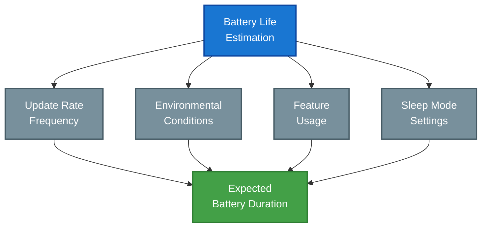

## Overview

Proper battery management is crucial for maintaining reliable RTLS tag operation. This guide covers battery specifications, replacement procedures, and optimization strategies.

## Battery Specifications

### Supported Battery Types
| Tag Series | Battery Type | Capacity | Voltage | Quantity |
|------------|--------------|----------|----------|-----------|
| LC01 | CR2032 | 225mAh | 3.0V | 1x |
| LC03 | CR2450 | 620mAh | 3.0V | 2x |
| Vehicle Tags | External | N/A | 12-24V | N/A |
| Special | Application specific | Varies | Varies | Varies |

### Expected Battery Life

### Life Estimates
| Configuration | Update Rate | Features | Life Expectancy |
|---------------|-------------|----------|-----------------|
| High Precision | 10Hz | All active | 3-6 months |
| Standard | 1Hz | Basic | 1-2 years |
| Power Save | 0.2Hz | Minimal | 3-5 years |
| Motion Based | Variable | Selective | 1-3 years |

## Battery Replacement

### Replacement Procedure
1. **Preparation**
   - Clean workspace
   - Proper tools
   - New battery
   - ESD protection

2. **Tag Access**
   - Power down tag
   - Open battery compartment
   - Note orientation
   - Remove old battery

3. **Installation**
   - Clean contacts
   - Insert new battery
   - Verify polarity
   - Close compartment

4. **Verification**
   - Power up check
   - LED indication
   - System detection
   - Position verification

### Safety Guidelines
- Use approved batteries
- Maintain polarity
- Avoid metal tools
- Clean environment
- Proper disposal

## Power Optimization

### Configuration Strategies
| Strategy | Impact | Trade-off |
|----------|---------|-----------|
| Reduce update rate | Major positive | Lower resolution |
| Enable sleep modes | Major positive | Response delay |
| Motion activation | Moderate positive | Setup complexity |
| Sensor scheduling | Minor positive | Feature limitation |

### Environmental Factors
- Temperature impact
- Signal strength
- Motion frequency
- Update demands
- Feature usage

## Monitoring Tools

### Battery Status
- Real-time monitoring
- Historical trends
- Alert thresholds
- Replacement planning
- Usage analytics

### System Integration
- RTLS Hub dashboard
- Email notifications
- API integration
- Maintenance scheduling
- Report generation

## Maintenance Planning

### Preventive Maintenance
1. Regular inspections
2. Scheduled replacements
3. Performance monitoring
4. Environmental checks
5. System optimization

### Best Practices
- Batch replacements
- Rotation strategy
- Inventory management
- Testing protocol
- Documentation

## Troubleshooting

### Common Issues
| Issue | Possible Cause | Solution |
|-------|---------------|----------|
| Short life | High update rate | Adjust configuration |
| No power | Poor contact | Clean/adjust contacts |
| Intermittent | Low battery | Replace battery |
| System error | Configuration | Reset/reconfigure |

### Diagnostic Steps
1. Check battery voltage
2. Verify configuration
3. Test in known state
4. Monitor performance
5. Document findings

## Related Documentation

- [Smart Sleep Modes](./smartsleepmodes)
- [Default Configurations](./defaultconfigurations)
- [Tag Peripherals](./tagperipherals)
- [LC01 Series](./tagtypes/lc01series)
- [LC03 Series](./tagtypes/lc03series)

<Callout type="warning">
Always use approved battery types and follow proper handling procedures. Incorrect battery replacement can damage tags or create safety hazards.
</Callout>

<Callout type="info">
For specialized tag variants or custom power configurations, consult the specific product documentation or contact Locus support.
</Callout>
