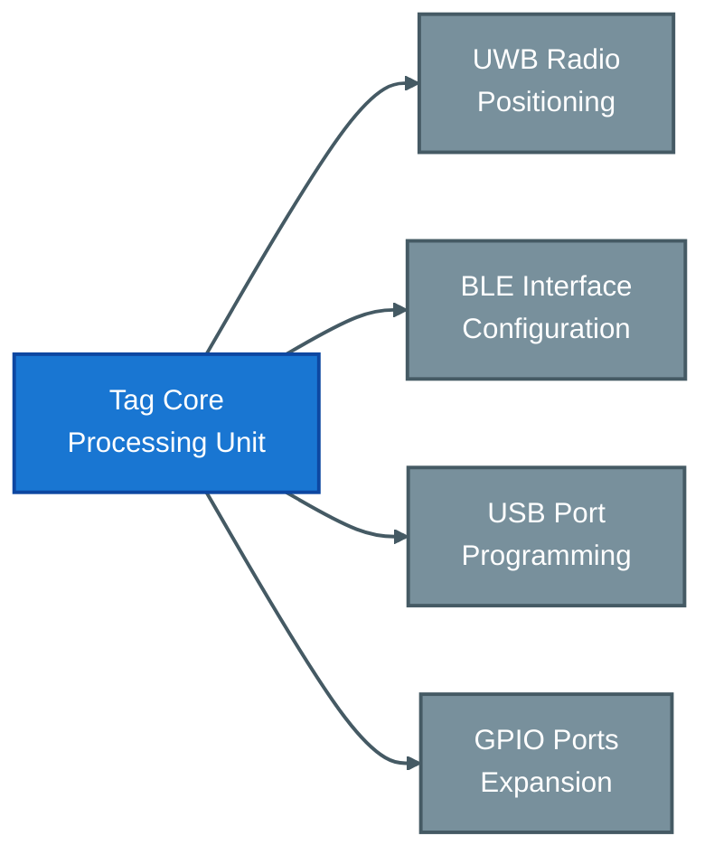

# Tag Peripherals and Interfaces

## Overview

Locus RTLS tags support various peripherals and interfaces to extend their functionality beyond basic positioning. This guide covers available peripherals, their integration, and common use cases.

## Standard Peripherals

### Motion Sensors
| Feature | Specification | Applications |
|---------|--------------|--------------|
| Type | 3-axis accelerometer | Movement detection |
| Range | ±2g to ±16g | Impact monitoring |
| Resolution | 16-bit | Activity analysis |
| Power | Ultra-low power | Battery optimization |

### Temperature Sensors
- Range: -40°C to +85°C
- Accuracy: ±0.5°C
- Resolution: 0.0625°C
- Response time: < 2s

### User Interface Elements
- Status LEDs
- Push buttons
- Buzzers
- Vibration motors
- Emergency alerts

## Advanced Sensors

### Environmental Monitoring
| Sensor | Range | Accuracy | Use Case |
|--------|--------|----------|-----------|
| Humidity | 0-100% RH | ±2% | Climate control |
| Pressure | 300-1100 hPa | ±1 hPa | Altitude tracking |
| Light | 0.01-83k lux | ±15% | Exposure monitoring |
| Gas | Application specific | Varies | Safety monitoring |

### Specialized Sensors
- Magnetic field detection
- Proximity sensing
- Angular position
- Tilt measurement
- Rotation tracking

## Communication Interfaces

### Primary Interfaces

### Digital I/O
- Input channels: Up to 4
- Output channels: Up to 2
- Logic levels: 3.3V
- Protection: ESD & overcurrent

### Analog Interfaces
- ADC inputs: 12-bit
- Voltage range: 0-3.3V
- Sampling rate: Up to 1kHz
- Input protection: Yes

## Integration Options

### External Sensors
1. Direct connection
2. I²C interface
3. SPI bus
4. Analog inputs
5. Digital inputs

### Power Options
- Battery powered
- External DC
- Energy harvesting
- USB powered
- Wireless charging

## Common Applications

### Industrial Monitoring
- Machine status
- Process variables
- Environmental conditions
- Equipment health
- Safety parameters

### Asset Management
- Usage tracking
- Condition monitoring
- Maintenance alerts
- Location history
- Status reporting

### Personnel Safety
- Man-down detection
- Emergency signaling
- Environment monitoring
- Access control
- Activity tracking

## Configuration

### Peripheral Setup
1. Hardware connection
2. Software configuration
3. Calibration
4. Testing
5. Validation

### Data Collection
| Method | Rate | Storage |
|--------|------|---------|
| Real-time | Up to 100Hz | Stream |
| Buffered | 1Hz typical | Local |
| Event-based | On trigger | Alert |
| Logged | Configurable | Memory |

## Development Support

### Integration Tools
- SDK access
- API documentation
- Example code
- Test utilities
- Debug tools

### Custom Development
- Hardware design support
- Firmware customization
- Protocol adaptation
- Certification assistance
- Integration consulting

## Related Documentation

- [LC01 Series](./tagtypes/lc01series)
- [LC03 Series](./tagtypes/lc03series)
- [Smart Sleep Modes](./smartsleepmodes)
- [Default Configurations](./defaultconfigurations)

<Callout type="warning">
Peripheral integration may affect tag battery life and update rates. Always validate the complete solution under expected operating conditions.
</Callout>

<Callout type="info">
Contact Locus support for detailed peripheral specifications and integration guidelines for your specific application requirements.
</Callout>
