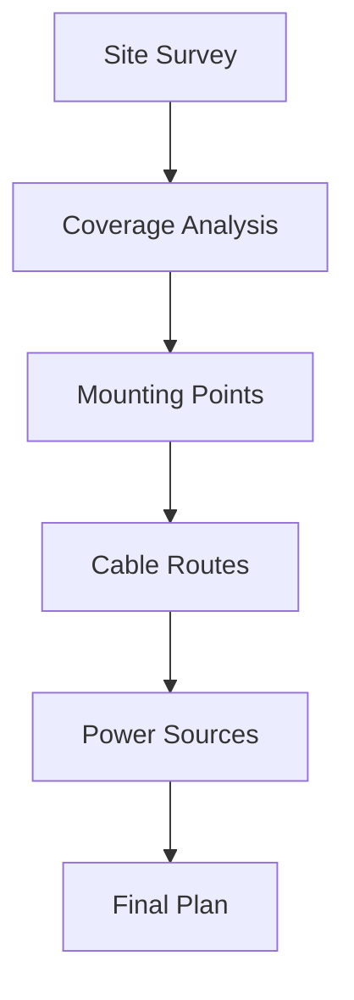

# Assembly and Mounting Guide

## Overview

Proper anchor mounting is crucial for optimal RTLS performance. This guide covers all aspects of anchor assembly and installation.

## Mounting Options

### Standard Methods

| Method | Use Case | Key Benefits |
|--------|----------|--------------|
| Wall Mount | Most common | Easy access, simple installation |
| Ceiling Mount | Open areas | Best coverage, clean appearance |
| Pole Mount | Industrial | Flexible positioning, sturdy |
| Truss Mount | Temporary | Quick deployment, adjustable |

### Mounting Kits
- Standard wall/ceiling kit
- Industrial pole mount kit
- Truss clamp kit
- Security mount kit

## Installation Planning

### Site Survey

### Positioning Requirements
| Parameter | Requirement | Notes |
|-----------|-------------|--------|
| Height | 2.5-3m optimal | From floor level |
| Spacing | 5m minimum | Between anchors |
| Line of Sight | Required | For optimal performance |
| Clearance | 30cm radius | From metal objects |

## Installation Procedure

### Wall/Ceiling Mounting
1. **Preparation**
   - Gather required tools
   - Verify mounting location
   - Check wall/ceiling material
   - Locate power source

2. **Bracket Installation**
   
   - Mark mounting points
   - Drill pilot holes
   - Install anchors
   - Secure bracket

3. **Anchor Mounting**
   - Attach anchor to bracket
   - Secure all fasteners
   - Connect cables
   - Verify orientation

### Pole Mounting
1. **Adapter Setup**
   - Select correct adapter
   - Assemble components
   - Prepare mounting straps

2. **Installation**
   - Position adapter
   - Secure straps
   - Mount anchor
   - Route cables

## Cable Management

### Best Practices
- Use proper cable guides
- Maintain bend radius
- Secure at intervals
- Label all cables

### Cable Requirements
| Type | Specification | Notes |
|------|--------------|--------|
| Ethernet | Cat5e or better | For PoE |
| Bend Radius | 25mm minimum | Prevent damage |
| Service Loop | 30cm extra | For maintenance |
| Strain Relief | Required | At connections |

## Orientation Guidelines

### Optimal Positioning

- Logo facing coverage area
- Antenna vertical alignment
- Clear signal path
- Proper spacing

### Coverage Patterns
- Standard coverage: 120° horizontal
- Extended coverage: Optional antenna
- Height impact on coverage
- Overlap considerations

## Environmental Considerations

### Indoor Installation
- Temperature range
- Humidity levels
- Interference sources
- Access requirements

### Special Environments
- Clean rooms
- Industrial areas
- High ceiling spaces
- Temporary setups

## Safety Guidelines

### Installation Safety
- Use proper tools
- Follow local codes
- Wear PPE
- Secure work area

### Electrical Safety
- Proper grounding
- PoE safety
- Cable protection
- Power isolation

## Maintenance Access

### Planning
- Service access routes
- Maintenance clearance
- Tool requirements
- Safety considerations

### Documentation
- Installation photos
- Cable labels
- Location maps
- Maintenance logs

## Related Documentation

- [Power Supply Guide](./powersupply)
- [Technical Specifications](./technicalspecifications)
- [LED Indicators](./anchorledindication)
- [Accessories Guide](./accessories)

<Callout type="warning">
Always follow local building codes and safety regulations when installing anchors. Ensure proper load capacity of mounting surfaces and use appropriate fasteners for the installation environment.
</Callout>
