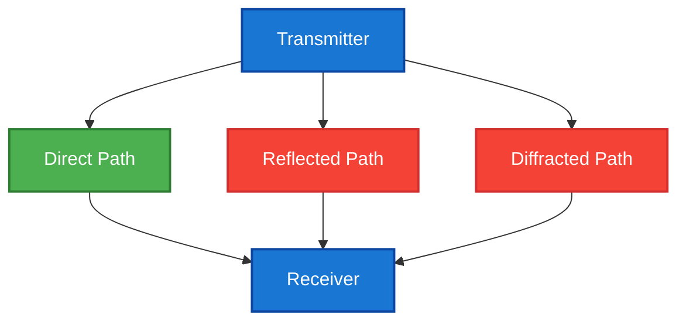
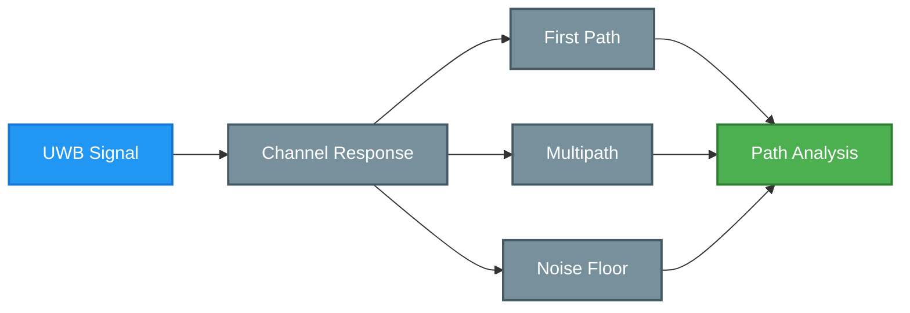
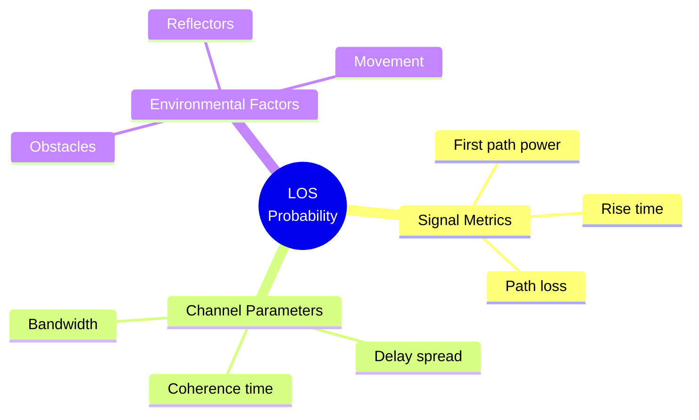
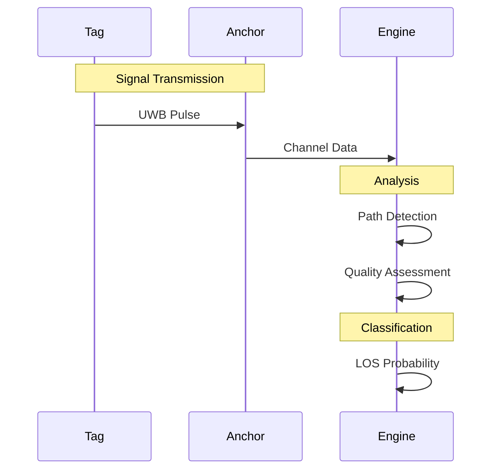
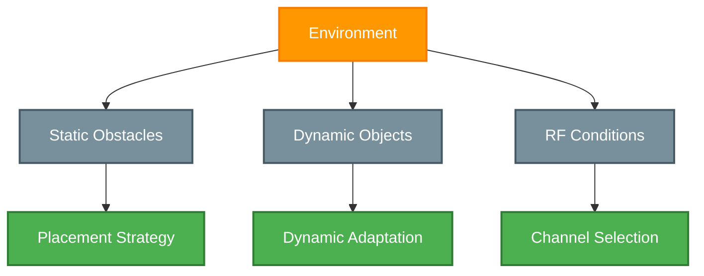

# Line of Sight (LOS)

## Overview

Line of Sight (LOS) parameters are fundamental metrics in Locus RTLS that characterize signal propagation paths between system components. These parameters are crucial for determining measurement quality, optimizing system performance, and ensuring reliable positioning.

## Signal Propagation

### Path Types

### Signal Characteristics
| Path Type | Delay | Power | Reliability |
|-----------|-------|-------|-------------|
| Direct | Minimal | Strongest | Highest |
| Reflected | Variable | Attenuated | Medium |
| Diffracted | Extended | Weak | Low |
| Scattered | Random | Very weak | Unreliable |

## LOS Parameters

### Channel Impulse Response

### Quality Metrics
| Parameter | LOS | NLOS | Impact |
|-----------|-----|------|---------|
| First Path Power | Greater than \-85 dBm | Less than \-85 dBm | Critical |
| Path Loss | Less than \-20 dB/m | Greater than \-20 dB/m | High |
| Delay Spread | Less than 20 ns | Greater than 20 ns | Medium |
| SNR | Greater than 10 dB | Less than 10 dB | High |

## LOS Probability

### Classification Model

### Probability Ranges
| Range | Classification | Reliability | Usage |
|-------|---------------|-------------|--------|
| 90-100% | Clear LOS | Very High | Primary |
| 70-90% | Partial LOS | High | Secondary |
| 40-70% | Mixed | Medium | Supplementary |
| 10-40% | NLOS | Low | Conditional |
| 0-10% | Deep NLOS | Very Low | Excluded |

## System Implementation

### Measurement Process

### Performance Optimization
1. **Signal Analysis**
   - Path detection
   - Power measurement
   - Timing analysis
   - Quality metrics

2. **Path Classification**
   - LOS probability
   - Path reliability
   - Error estimation
   - Confidence level

3. **System Adaptation**
   - Weight assignment
   - Path selection
   - Algorithm tuning
   - Performance tracking

## Deployment Considerations

### Environmental Analysis

### Optimization Strategies
| Factor | Strategy | Benefit | Implementation |
|--------|----------|---------|----------------|
| Coverage | Anchor density | Better LOS | Installation |
| Obstacles | Height adjustment | Path clearance | Mounting |
| Movement | Dynamic tracking | Path adaptation | Software |
| Interference | Channel selection | Signal quality | Configuration |

## System Integration

### Monitoring Tools
1. **Real-time Analysis**
   - Path quality
   - LOS probability
   - Signal metrics
   - System health

2. **Historical Tracking**
   - Performance trends
   - Quality changes
   - Path stability
   - System adaptation

3. **Optimization Tools**
   - Coverage maps
   - Quality analysis
   - Path visualization
   - Performance reports

## Best Practices

### Implementation Guidelines
1. **Design Phase**
   - Site survey
   - Coverage planning
   - Anchor placement
   - Path analysis

2. **Installation**
   - Height optimization
   - Orientation setup
   - Path validation
   - Performance testing

3. **Maintenance**
   - Regular monitoring
   - Path verification
   - System tuning
   - Performance optimization

## Related Documentation

- [RSSI](./rssi)
- [First Path](./firstpath)
- [UWB Technology](../uwbtechnology)
- [System Architecture](../rtlsystemarchitecture)

<Callout type="warning">
LOS parameters significantly impact positioning accuracy. Regular monitoring and optimization of LOS conditions is essential for optimal system performance.
</Callout>

<Callout type="info">
Contact Locus support for detailed LOS analysis tools and optimization recommendations for your specific deployment environment.
</Callout>
