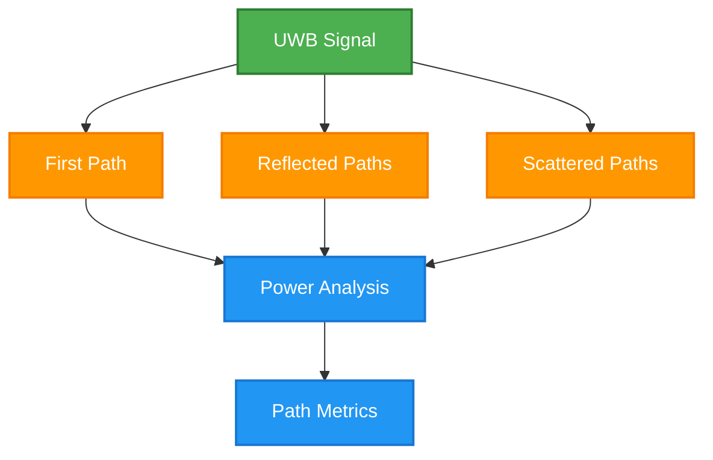
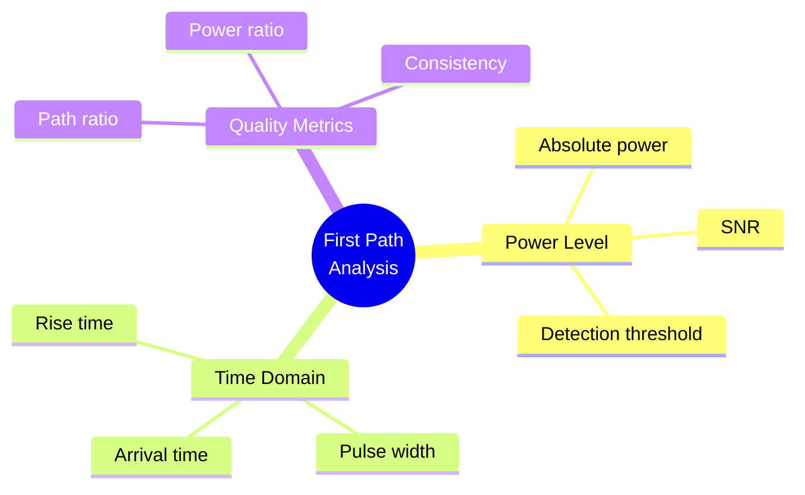
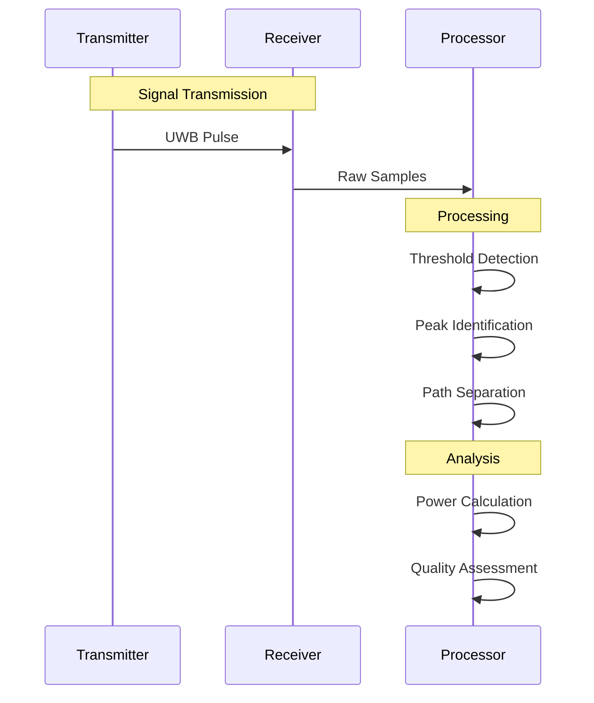
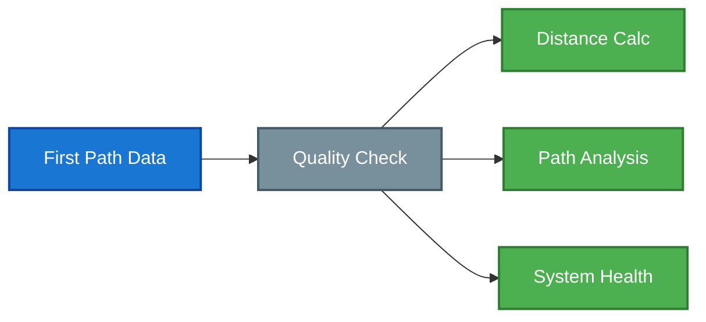
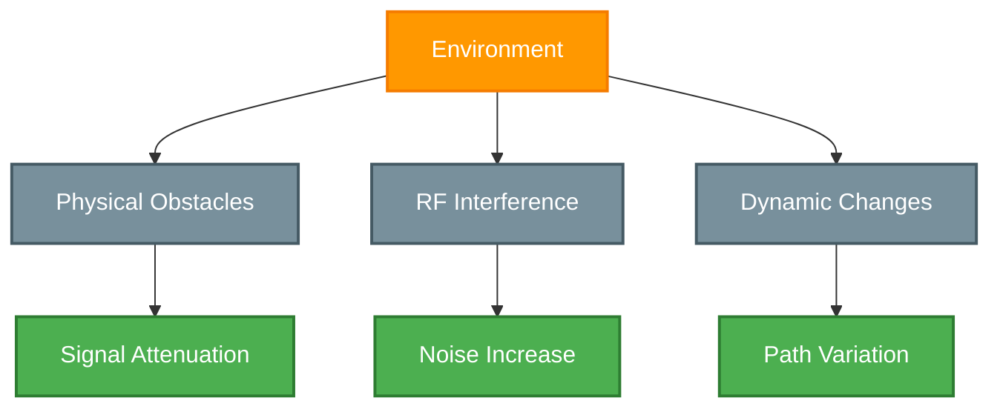

## Overview

First Path Power is a fundamental RF parameter in Ultra-Wideband (UWB) positioning systems that measures the power of the initial signal component arriving at a receiver. This metric is crucial for accurate distance estimation, path analysis, and system optimization.

## Signal Components

### Path Analysis

### Signal Characteristics
| Component | Arrival Time | Power Level | Reliability |
|-----------|-------------|-------------|-------------|
| First Path | Earliest | Variable | Primary |
| Reflections | Delayed | Often stronger | Secondary |
| Scattering | Extended | Typically weak | Limited |
| Noise | Continuous | Background | N/A |

## Measurement Parameters

### Power Metrics

### Performance Indicators
| Metric | Good | Marginal | Poor |
|--------|------|----------|------|
| Power | Greater than \-85 dBm | \-85 to \-95 dBm | Less than \-95 dBm |
| SNR | Greater than 10 dB | 5-10 dB | Less than 5 dB |
| Path Ratio | Greater than 0.7 | 0.3-0.7 | Less than 0.3 |
| Consistency | Less than 2 dB | 2-5 dB | Greater than 5 dB |

## Signal Processing

### Detection Process

### Analysis Methods
1. **Signal Detection**
   - Threshold crossing
   - Leading edge
   - Peak detection
   - Noise filtering

2. **Path Separation**
   - Time windowing
   - Power thresholds
   - Pattern matching
   - Statistical analysis

3. **Quality Assessment**
   - SNR calculation
   - Path ratios
   - Consistency check
   - Error estimation

## System Integration

### Performance Analysis

### System Applications
| Application | Use Case | Requirements | Benefits |
|-------------|----------|--------------|----------|
| Ranging | Distance measurement | High SNR | Accuracy |
| Positioning | Location calculation | Good geometry | Precision |
| Monitoring | System health | Stability | Reliability |
| Diagnostics | Problem detection | Sensitivity | Maintenance |

## Environmental Factors

### Impact Analysis

### Mitigation Strategies
| Factor | Impact | Strategy | Implementation |
|--------|--------|----------|----------------|
| Obstacles | Attenuation | Path planning | Installation |
| Interference | Noise | Channel selection | Configuration |
| Multipath | Distortion | Processing | Algorithms |
| Movement | Variation | Dynamic tracking | Software |

## System Optimization

### Monitoring Tools
1. **Real-time Analysis**
   - Power levels
   - Path ratios
   - Quality metrics
   - System alerts

2. **Historical Analysis**
   - Trend tracking
   - Pattern detection
   - Performance logs
   - Issue correlation

3. **Diagnostic Tools**
   - Path visualization
   - Quality mapping
   - Problem isolation
   - Performance tuning

## Best Practices

### Implementation Guidelines
1. **System Setup**
   - Anchor placement
   - Power levels
   - Channel selection
   - Initial calibration

2. **Operation**
   - Regular monitoring
   - Performance checks
   - Quality thresholds
   - Alert handling

3. **Maintenance**
   - Periodic validation
   - System tuning
   - Issue resolution
   - Performance optimization

## Related Documentation

- [Line of Sight (LOS)](./los)
- [RSSI](./rssi)
- [UWB Technology](../uwbtechnology)
- [System Architecture](../rtlsystemarchitecture)

<Callout type="warning">
First Path Power measurements are critical for accurate positioning. Regular monitoring and optimization of First Path parameters is essential for system reliability.
</Callout>

<Callout type="info">
Contact Locus support for detailed First Path analysis tools and optimization recommendations for your specific deployment environment.
</Callout>
