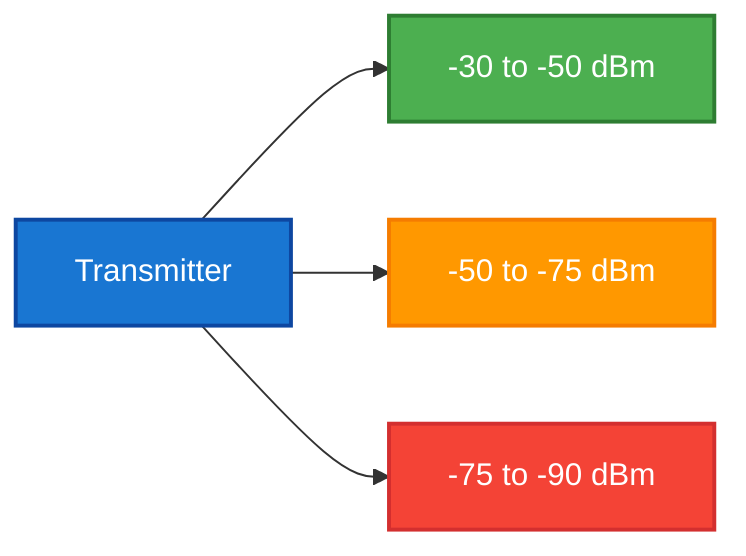
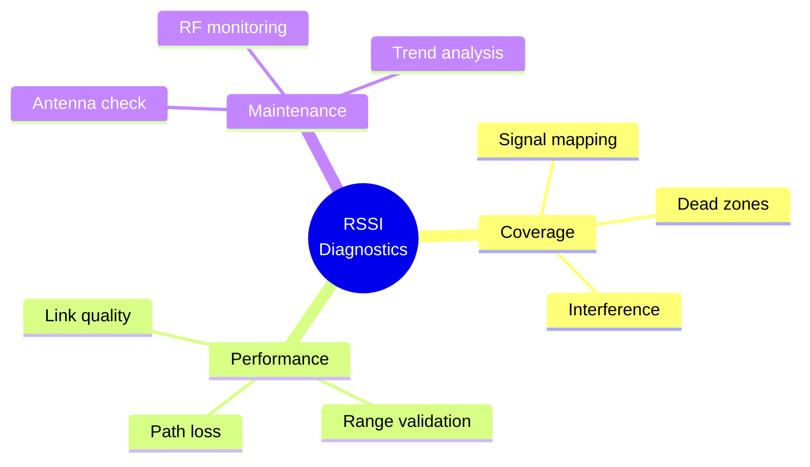
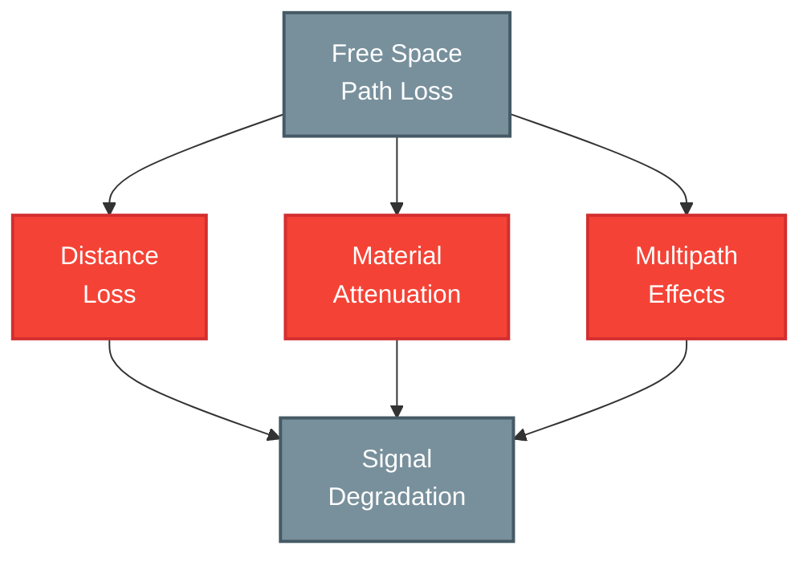
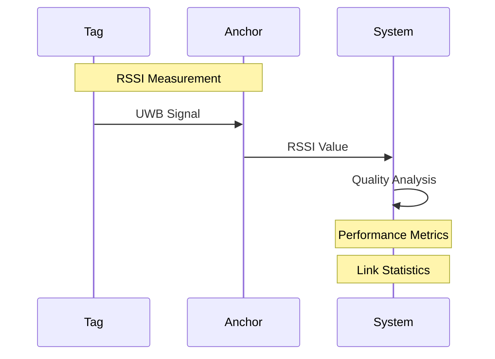
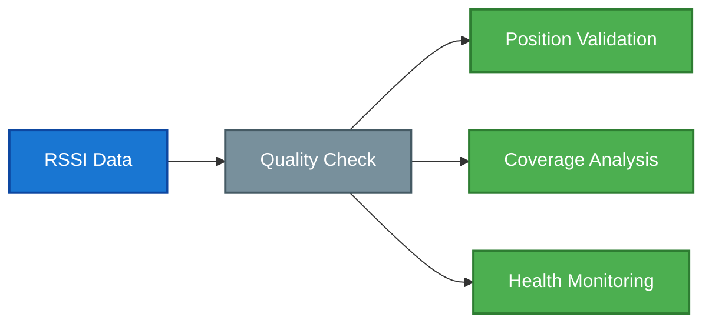

# RSSI (Received Signal Strength Indicator)

## Overview

RSSI (Received Signal Strength Indicator) is a fundamental RF measurement that quantifies received signal power in radio communications. In Locus RTLS systems, RSSI serves as a critical metric for system diagnostics, range estimation, and positioning validation.

## RSSI Fundamentals

### Signal Measurement

### Signal Characteristics
| Parameter | Range | Description | Application |
|-----------|-------|-------------|-------------|
| Strong Signal | -30 to -50 dBm | Optimal range | Direct LOS |
| Good Signal | -50 to -65 dBm | Normal operation | Typical indoor |
| Fair Signal | -65 to -75 dBm | Acceptable | Through walls |
| Poor Signal | -75 to -85 dBm | Marginal | Long range |
| Very Poor | Below -85 dBm | Unreliable | Out of range |

## RSSI Applications

### System Diagnostics

### Installation Optimization
1. **Coverage Mapping**
   - Signal strength surveys
   - Heat map generation
   - Weak spot identification
   - Overlap verification

2. **Anchor Placement**
   - Line-of-sight validation
   - Inter-anchor visibility
   - Coverage optimization
   - Interference avoidance

3. **System Validation**
   - Performance verification
   - Range confirmation
   - Link reliability
   - Network health

## Signal Propagation

### Path Loss Model

### Environmental Factors
| Factor | Impact | Mitigation |
|--------|--------|------------|
| Distance | -20dB/decade | Anchor density |
| Walls | -3 to -15 dB | Strategic placement |
| Multipath | ±6 dB | Diversity techniques |
| Interference | Variable | Channel selection |
| Orientation | Up to -20 dB | Antenna design |

## Performance Analysis

### Signal Quality Metrics

### Quality Indicators
| Metric | Good | Warning | Critical |
|--------|------|---------|----------|
| RSSI | Greater than \-65 dBm | \-65 to \-75 dBm | Less than \-75 dBm |
| Stability | ±3 dB | ±6 dB | Greater than ±6 dB |
| Coverage | Greater than 90% | 70-90% | Less than 70% |
| Reliability | Greater than 99% | 95-99% | Less than 95% |

## System Integration

### Monitoring Tools
1. **Real-time Display**
   - Current RSSI values
   - Trend graphs
   - Alert thresholds
   - Quality indicators

2. **Historical Analysis**
   - Long-term trends
   - Pattern detection
   - Performance tracking
   - Issue correlation

3. **Diagnostic Features**
   - Signal mapping
   - Coverage analysis
   - Problem detection
   - Health monitoring

### Data Utilization

## Best Practices

### Implementation Guidelines
1. **Baseline Establishment**
   - Initial surveys
   - Reference measurements
   - Performance benchmarks
   - Coverage mapping

2. **Monitoring Protocol**
   - Regular checks
   - Trend analysis
   - Alert thresholds
   - Response procedures

3. **Maintenance Schedule**
   - Periodic validation
   - System calibration
   - Performance tuning
   - Issue prevention

## Related Documentation

- [Line of Sight (LOS)](./los)
- [First Path](./firstpath)
- [UWB Technology](../uwbtechnology)
- [System Architecture](../rtlsystemarchitecture)

<Callout type="warning">
RSSI values should be used as one of several metrics for system health assessment. Do not rely solely on RSSI for critical positioning decisions.
</Callout>

<Callout type="info">
Contact Locus support for detailed RSSI analysis tools and optimization recommendations for your specific deployment environment.
</Callout>
