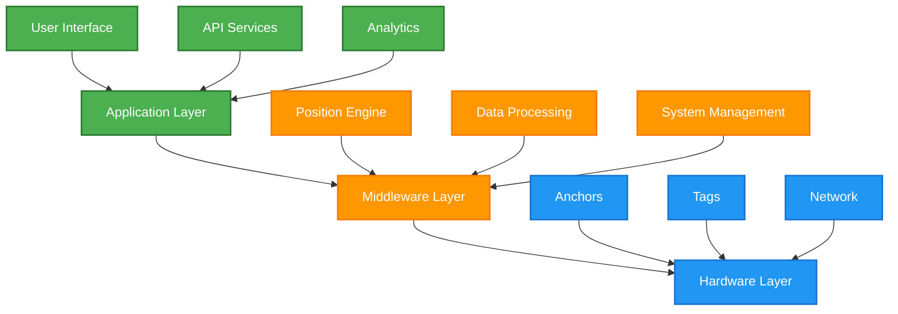
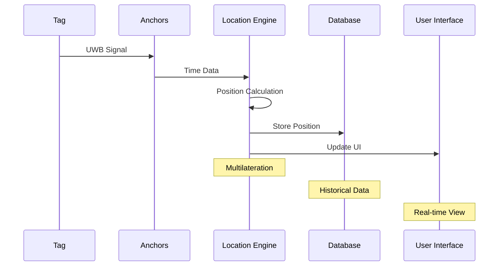
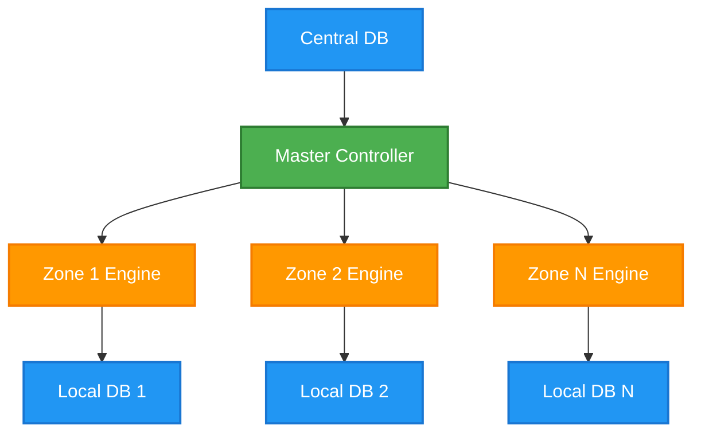
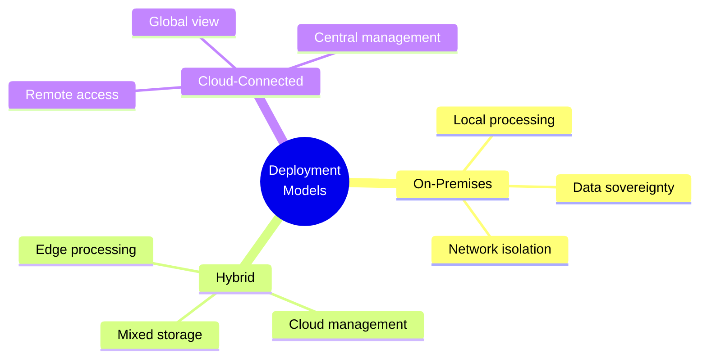
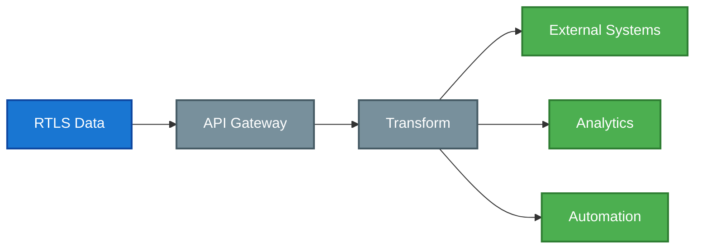

# RTLS System Architecture

## Overview

The Locus RTLS system employs a sophisticated multi-layer architecture designed for scalability, reliability, and high-precision real-time location tracking. This guide details the system components, data flow, deployment options, and integration capabilities.

## System Components

### Architecture Layers

### Hardware Components
| Component | Function | Specifications | Connectivity |
|-----------|----------|----------------|--------------|
| Anchors | Fixed reference | PoE, UWB radio | Ethernet |
| Tags | Mobile tracking | Battery, UWB | Wireless |
| Location Engine | Processing | Edge compute | Ethernet |
| Network | Infrastructure | Gigabit | Ethernet/Fiber |

### Middleware Services

## Data Flow Architecture

### Position Calculation Flow

### Data Processing Pipeline
1. **Signal Collection**
   - UWB transmission
   - Time stamping
   - Signal metrics
   - Channel data

2. **Position Calculation**
   - Time synchronization
   - Multilateration
   - Error correction
   - Filtering

3. **Data Distribution**
   - Local storage
   - API endpoints
   - User interface
   - Integrations

## Scalability Architecture

### System Scaling

### Performance Metrics
| Scale Factor | Basic | Standard | Enterprise |
|--------------|-------|----------|------------|
| Tags | \<1000 | 1000-5000 | >5000 |
| Anchors | \<100 | 100-500 | >500 |
| Update Rate | 1Hz | 10Hz | Custom |
| Area | \<10000m² | \<50000m² | >50000m² |

## Deployment Models

### Architecture Options

### Model Comparison
| Feature | On-Premises | Hybrid | Cloud |
|---------|-------------|--------|--------|
| Data Location | Local | Mixed | Distributed |
| Management | Local | Mixed | Remote |
| Scalability | Limited | Good | Excellent |
| Connectivity | Optional | Required | Required |
| Security | Isolated | Mixed | Enhanced |

## Integration Architecture

### API Services
- REST API
- WebSocket
- MQTT
- Custom protocols
- Event webhooks

### Data Integration

## Security Architecture

### Security Layers
1. **Physical Security**
   - Secure boot
   - Hardware encryption
   - Tamper detection
   - Secure storage

2. **Network Security**
   - TLS encryption
   - Certificate auth
   - Network isolation
   - Access control

3. **Application Security**
   - Role-based access
   - Audit logging
   - Data encryption
   - Session management

### Security Features
| Layer | Feature | Implementation |
|-------|---------|----------------|
| Hardware | Secure Element | TPM/HSM |
| Network | Encryption | TLS 1.3 |
| Data | Protection | AES-256 |
| Access | Control | OAuth 2.0 |
| Audit | Logging | Centralized |

## System Requirements

### Hardware Requirements
| Component | Minimum | Recommended |
|-----------|---------|-------------|
| Network | 1Gbps | 10Gbps |
| Power | PoE | PoE+ |
| Server | 4 cores | 8+ cores |
| Memory | 8GB | 16GB+ |
| Storage | 100GB | 500GB+ |

### Software Requirements
- Linux OS
- Docker support
- PostgreSQL
- Redis
- Node.js

## Related Documentation

- [UWB Technology](./uwbtechnology)
- [UWB Channels and Profiles](./uwbchannelsandprofiles)
- [RF Performance Parameters](./rfperformanceparameters)

<Callout type="warning">
System architecture design significantly impacts performance, scalability, and maintenance. Carefully consider deployment requirements and future growth needs during planning.
</Callout>

<Callout type="info">
Contact Locus support for detailed architecture planning assistance and deployment recommendations for your specific requirements.
</Callout>
