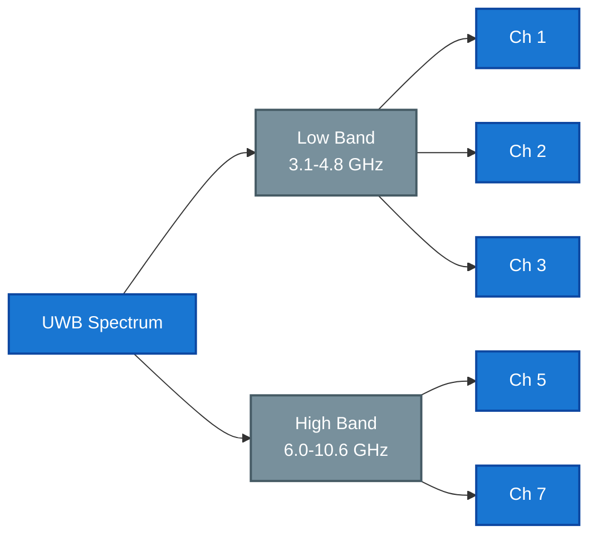
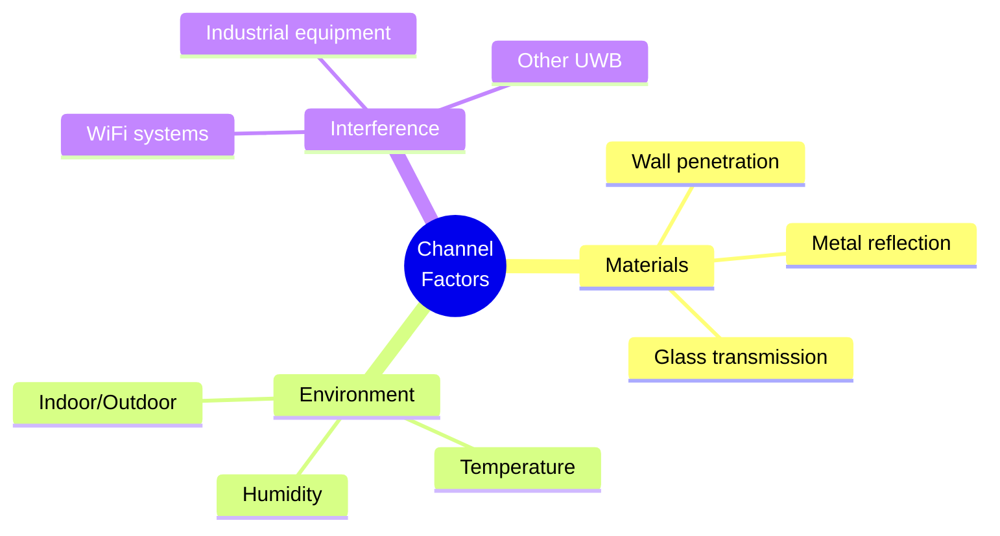
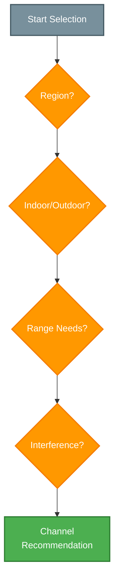

## Overview

Ultra-Wideband technology utilizes multiple frequency channels and operational profiles to optimize performance across different environments and use cases. This guide covers channel characteristics, selection criteria, and configuration recommendations.

## Channel Specifications

### Channel Parameters
| Channel | Center Freq (MHz) | Bandwidth (MHz) | PRF (MHz) | Power (dBm/MHz) |
|---------|------------------|-----------------|-----------|-----------------|
| 1 | 3494.4 | 499.2 | 16/64 | -41.3 |
| 2 | 3993.6 | 499.2 | 16/64 | -41.3 |
| 3 | 4492.8 | 499.2 | 16/64 | -41.3 |
| 5 | 6489.6 | 499.2 | 16/64 | -41.3 |
| 7 | 7987.2 | 499.2 | 16/64 | -41.3 |

### Frequency Distribution

## Channel Characteristics

### Performance Factors
| Factor | Low Band (Ch 1-3) | High Band (Ch 5,7) |
|--------|------------------|-------------------|
| Range | Longer | Shorter |
| Penetration | Better | Limited |
| Precision | Good | Excellent |
| Interference | More common | Less common |
| Power needs | Lower | Higher |

### Environmental Impact

## Regional Compliance

### Regulatory Overview
| Region | Available Channels | Power Limits | Notes |
|--------|-------------------|--------------|--------|
| USA/FCC | 1,2,3,5,7 | -41.3 dBm/MHz | All bands |
| EU/CE | 5,7 | -41.3 dBm/MHz | High band only |
| Japan | 1,2,3 | -41.3 dBm/MHz | Low band only |
| China | 5,7 | -41.3 dBm/MHz | High band only |

### Compliance Requirements
- Frequency restrictions
- Power limitations
- Duty cycle rules
- Certification needs
- Usage constraints

## Channel Selection

### Selection Process

### Selection Criteria
1. **Regulatory Compliance**
   - Regional restrictions
   - Power limits
   - Usage rules
   - Certification

2. **Environmental Factors**
   - Indoor/outdoor
   - Building materials
   - Space layout
   - Obstacles

3. **Performance Requirements**
   - Range needs
   - Accuracy goals
   - Update rate
   - Reliability

## Operating Profiles

### Standard Profiles
| Profile | PRF | Data Rate | Range | Use Case |
|---------|-----|-----------|--------|----------|
| Default | 16 MHz | 850 kbps | 50m | General use |
| Long Range | 16 MHz | 110 kbps | 100m | Extended range |
| High Speed | 64 MHz | 6.8 Mbps | 30m | Fast updates |
| Low Power | 16 MHz | 110 kbps | 30m | Battery life |

### Profile Configuration
- Channel selection
- PRF setting
- Preamble length
- SFD selection
- Data rate

## Deployment Guidelines

### Best Practices
1. **Site Survey**
   - RF environment
   - Coverage needs
   - Interference sources
   - Physical layout

2. **Channel Planning**
   - Primary channel
   - Backup channels
   - Interference zones
   - Power levels

3. **Performance Validation**
   - Range testing
   - Accuracy checks
   - Update rates
   - Reliability

## Related Documentation

- [UWB Technology](./uwbtechnology)
- [RTLS System Architecture](./rtlsystemarchitecture)
- [RF Performance Parameters](./rfperformanceparameters)

<Callout type="warning">
Channel selection significantly impacts system performance. Always verify regulatory compliance and conduct thorough site surveys before deployment.
</Callout>

<Callout type="info">
Contact Locus support for detailed channel planning assistance and region-specific deployment recommendations.
</Callout>

