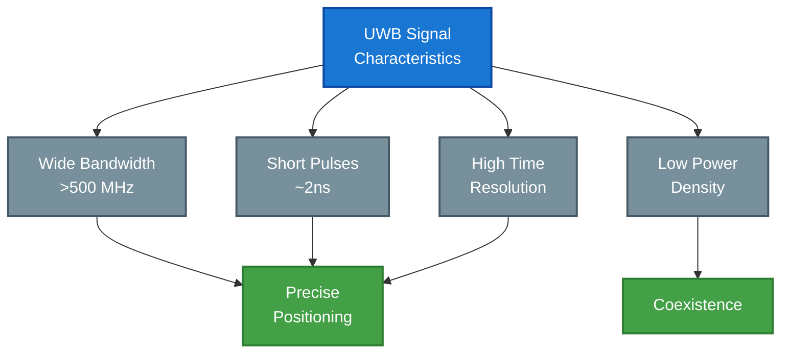
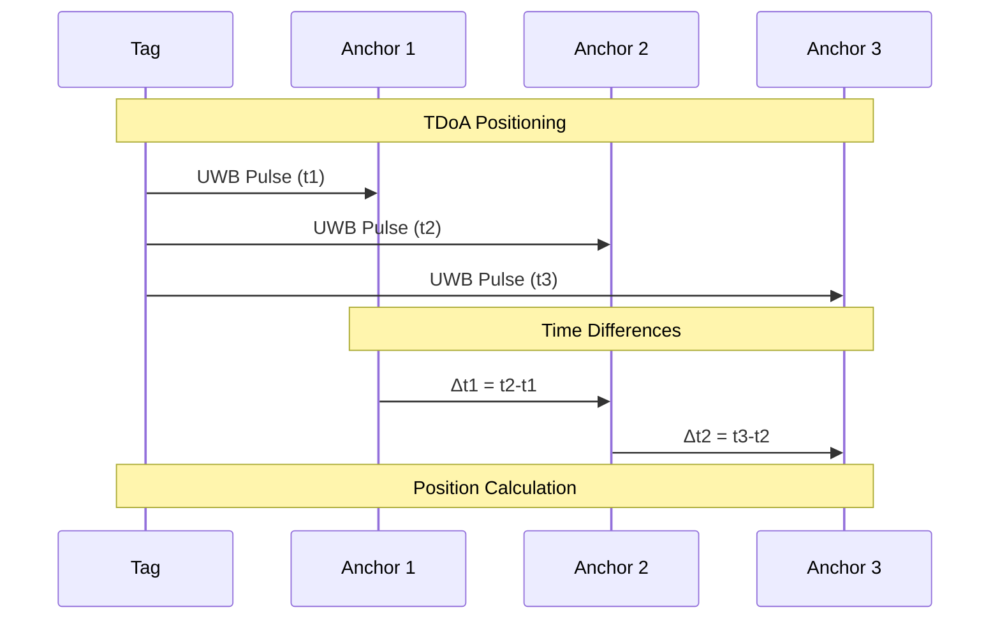
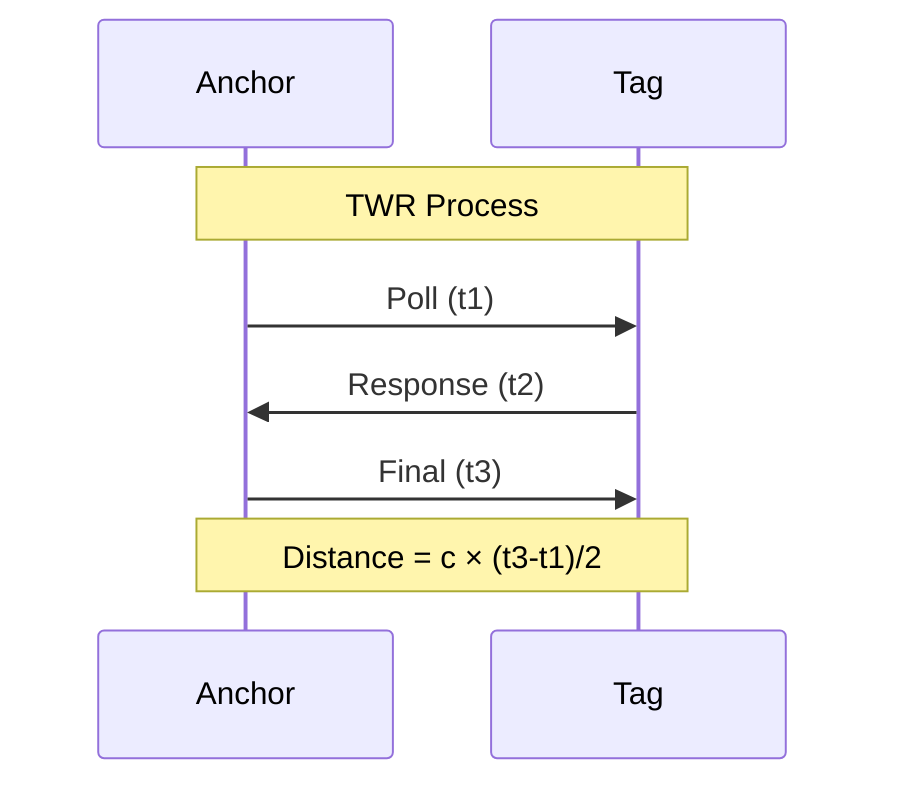
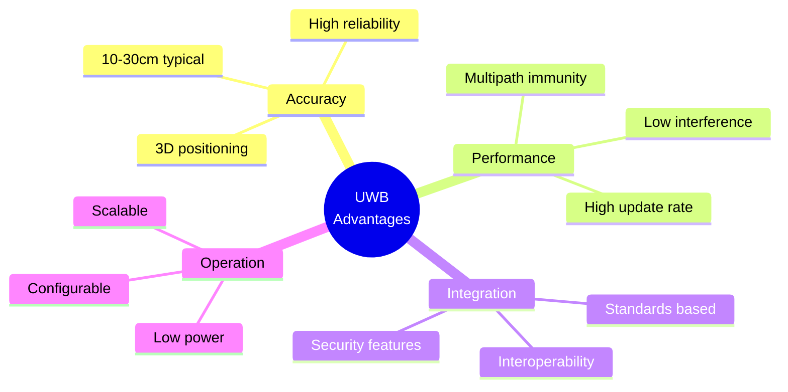

## Overview

Ultra-Wideband (UWB) is the advanced radio technology powering Locus RTLS systems. This guide explains UWB fundamentals, advantages, and implementation in high-precision indoor positioning.

## UWB Fundamentals

### Technical Characteristics
| Parameter | Specification | Impact |
|-----------|--------------|---------|
| Bandwidth | >500 MHz | High resolution |
| Pulse Duration | 2ns typical | Precise timing |
| Center Frequency | 3.1-10.6 GHz | Multiple channels |
| Power Density | -41.3 dBm/MHz | Low interference |
| PRF | 16-64 MHz | Configurable |

### Signal Characteristics

## Positioning Methods

### Time Difference of Arrival (TDoA)

### Two-Way Ranging (TWR)

## Performance Characteristics

### Accuracy Factors
| Factor | Impact | Mitigation |
|--------|--------|------------|
| Multipath | Signal reflections | Advanced algorithms |
| Clock drift | Timing errors | Synchronization |
| Signal strength | Range limitation | Power management |
| Interference | Position error | Channel selection |
| Geometry | DOP effects | Anchor placement |

### Environmental Considerations
- Line of sight requirements
- RF absorption/reflection
- Material penetration
- Temperature effects
- Humidity impact

## Technology Comparison

### Positioning Technologies
| Technology | Accuracy | Range | Power | Multipath | Cost |
|------------|----------|-------|-------|-----------|------|
| UWB | 10-30cm | 50-100m | Medium | Excellent | Higher |
| Bluetooth | 1-3m | 10-30m | Low | Poor | Low |
| WiFi | 3-15m | 50-100m | High | Poor | Medium |
| RFID | Proximity | 1-10m | Very Low | Poor | Medium |
| GPS | 5-10m | Global | High | N/A | Low |

### Key Advantages

## IEEE Standards Compliance

### IEEE 802.15.4z
- Enhanced ranging
- Security features
- Channel management
- Power control
- Interference mitigation

### Implementation
| Feature | Specification | Benefit |
|---------|--------------|----------|
| PHY | HRP/LRP UWB | Flexibility |
| Ranging | Enhanced TWR/TDoA | Accuracy |
| Security | Layer 2 | Protection |
| Channels | 3.1-10.6 GHz | Coverage |
| Data Rate | Up to 27 Mbps | Capability |

## Related Documentation

- [UWB Channels and Profiles](./uwbchannelsandprofiles)
- [RTLS System Architecture](./rtlsystemarchitecture)
- [RF Performance Parameters](./rfperformanceparameters)

<Callout type="warning">
UWB system performance depends on proper deployment planning, including anchor placement, channel selection, and environmental considerations.
</Callout>

<Callout type="info">
Contact Locus support for detailed UWB implementation guidelines and optimization recommendations for your specific environment.
</Callout>
